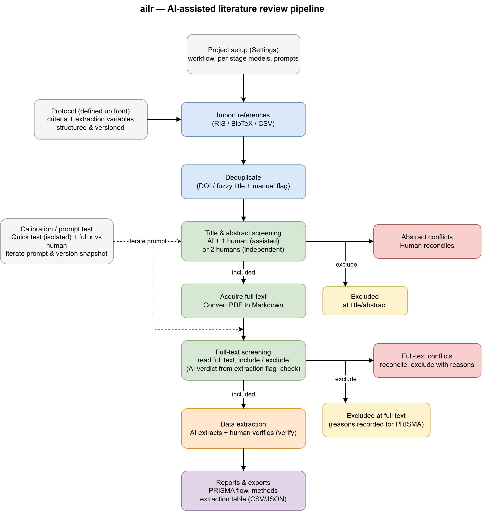
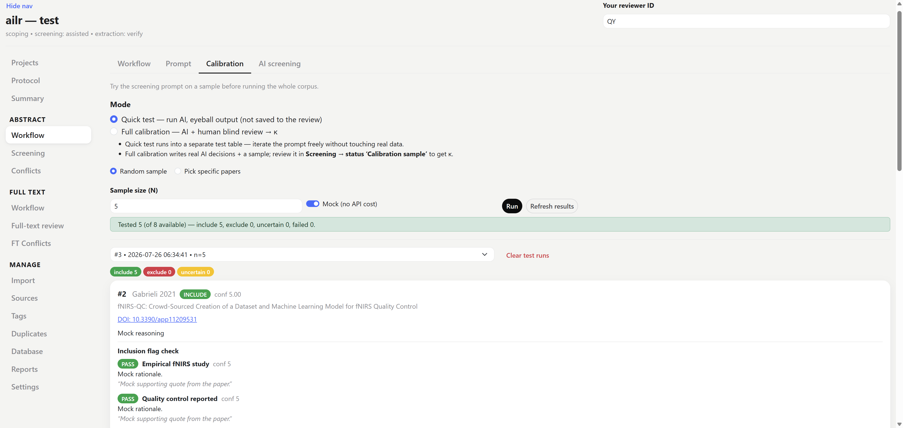
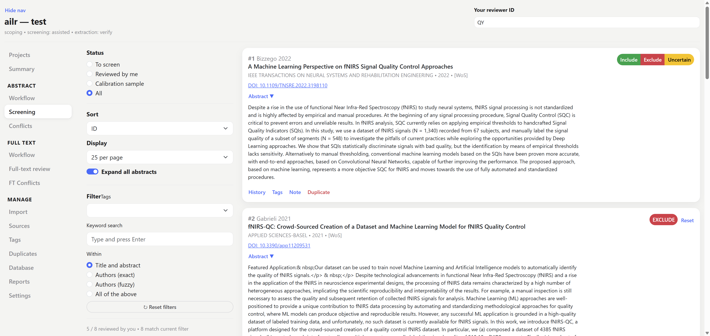
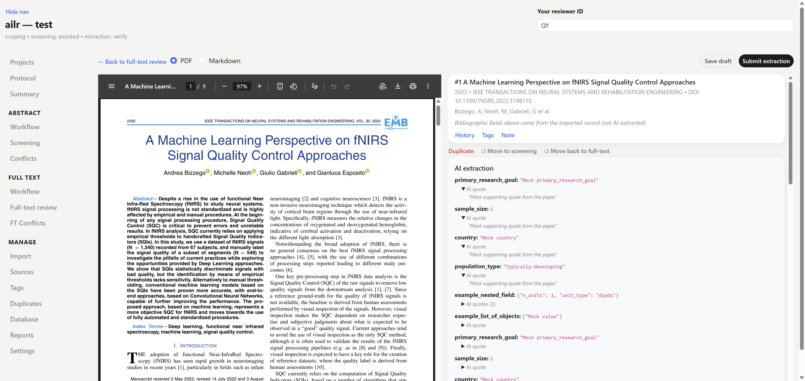
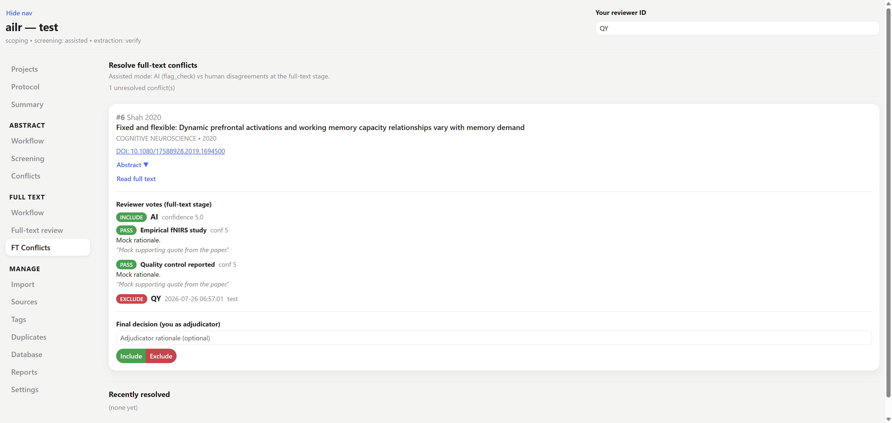
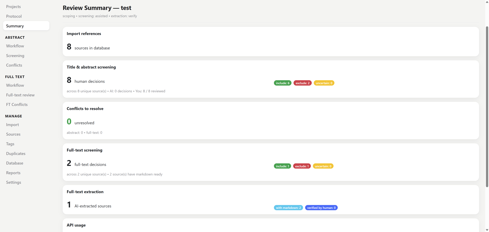

# ailr — AI-assisted literature review

A desktop app for running systematic and scoping literature reviews with an AI as a second reviewer. Domain-agnostic: your criteria, prompts, and extraction fields live in each project; the tool provides the pipeline (import → screen → full-text → extract → export) and a PRISMA-auditable trail.

Everything is doable from the **web UI** — you don't need the command line.

**[Read the full handbook →](https://qiuyuyu3.github.io/AILR-AI-assisted-literature-review-pipeline/)** — install, a walkthrough of every stage, team setup, and how AI extraction works.

<p align="center">
  
</p>

## Install

```bash
pip install -e ".[llm,pdf]"
```

The **web UI and PostgreSQL support are built in** (core dependencies). The optional extras are `llm` = AI providers and `pdf` = PDF→markdown. (`[ui]` / `[postgres]` still work as no-op aliases.)

## Start

```bash
ailr ui <project-folder>
```

Opens the app at http://localhost:8050. Or run `ailr ui` to open the **project manager** — create a new project (local SQLite, or a shared PostgreSQL URL) or open a recent one. CLI alternative: `ailr init my-review`.


### API key

To run the real AI (not Mock), export the provider's API key in the **same terminal** before launching, then start the app from that terminal so the child process inherits it:

```bash
export ANTHROPIC_API_KEY="sk-ant-..."   # OpenAI: OPENAI_API_KEY · Gemini: GEMINI_API_KEY
ailr ui <project-folder>
```

The key lives only in that shell session (gone when you close it) — nothing is written to the project folder or database. To avoid re-typing it each session, add the `export` line to your `~/.bashrc`. Settings shows `ANTHROPIC_API_KEY: set` once it's in the environment.

## How a review flows

The sidebar groups the pages: **Protocol** and **Summary** at the top, then **Abstract**, **Full text**, and **Manage** (importing, browsing, reports, settings).

0. **Protocol** — criteria, extraction variables, the three stage workflows (who screens and who extracts), and the review's registration (register, number, protocol URL) with an amendment log.
1. **Import** — drop a RIS / BibTeX / CSV of search results; duplicates are flagged automatically.
2. **Abstract → Workflow** — edit the screening prompt, **calibrate** (test on a sample, Cohen's κ vs human), and run AI screening.
3. **Abstract → Screening** — a card list with Include / Exclude / Uncertain. AI is blinded until you decide.
4. **Abstract → Conflicts** — reconcile where AI and human (or two humans) disagree.
5. **Full text → Workflow** — **Preparation**: link PDFs (Zotero RIS) and convert them to markdown, with scanned / low-text PDFs flagged. Then, as at the abstract stage, edit the extraction prompt, calibrate the AI's full-text verdict, and run AI extraction.
6. **Full-text review** — read the full text and include/exclude (with PRISMA reasons); abstracts can expand inline. Mark a full text you could not obtain as **not retrieved**, and group several reports of one study with **Same study as…**. For an included paper, the **To extract** filter shows an **Open extraction** button → verify/edit the AI's values per field (changes from the AI are highlighted).
7. **Full text → FT Conflicts** — reconcile full-text disagreements.
8. **Reports** — PRISMA flow, methods skeleton, inter-rater reliability + confusion matrix, API usage, and CSV/JSON/RIS exports.
9. **Sources / Tags / Duplicates / Database** — browse/manage records (with bulk actions on Sources), tag, review duplicates, and browse the raw tables.

### A look at the app

**Calibrate** the AI against human judgement (Cohen's κ) before screening.



**Screen** titles/abstracts — the AI stays blinded until you decide.



**Define** the fields to extract on Protocol → Variables.


**Verify** the AI's values, each backed by a source quote.



**Reconcile** full-text disagreements.



**Track** progress at every stage on the dashboard.



## Scope

Meta-analysis and GRADE are out of scope: export the extraction table and run those in R (`metafor`), RevMan, or GRADEpro.

## Workflow modes

Set per stage on **Protocol → Workflow** (or `ailr workflow <project> --stage ... --set ...`):

- **Abstract screening** — `assisted` (AI + 1 human, both blinded — PRISMA-trAIce) or `independent` (2 humans, blinded — Cochrane).
- **Full-text screening** — the same two options, set separately from the abstract stage (defaults to it). The usual design is `assisted` at title/abstract and `independent` at full text.
- **Extraction** — `verify` (AI extracts, human verifies) or `independent` (human extracts blind).

Bibliographic metadata (title, authors, year, journal, DOI) comes from the imported record and is joined into exports by `source_id` — the AI only extracts what the full text adds.

## Models & tokens

Each stage has its own model in **Settings** (provider / model / temperature), e.g. a cheaper model for abstract screening and a stronger one for full-text extraction. No model ships as a default, so set one before the first AI run. The provider's API key must be in your environment (see above). Token usage is logged per call (see Summary / Reports). Tokens only, no spend estimate.

## Working as a team

Give everyone a shared **PostgreSQL** database so you co-edit one project in real time. Use any managed Postgres host (several have free tiers) or self-host one.

1. Create a PostgreSQL database and copy its connection URL. Paste it as-is (`postgresql://…`); ailr selects the right driver automatically (`postgresql+psycopg://` also works).
2. Add it to the project's `lit_review.yaml`:
   ```yaml
   storage:
     database_url: "postgresql://user:pw@host/db?sslmode=require"
   ```
   Everyone who opens the same project folder connects to that database automatically. Each project's yaml can point to its own database. Settings shows `Shared Postgres` and the active database. **`lit_review.yaml` holds the DB password, so keep it out of a public git repo** (the generated `.gitignore` already excludes it).
3. Put the project **folder** on a shared drive (Box / OneDrive / Drive) so everyone has the same config (`lit_review.yaml`, prompts, criteria, variables) and opens it under the same project name. The decisions live in the shared DB, not the folder, and one DB can hold many projects (namespaced by project name).

Each person enters their own **reviewer ID** at the top; it is stamped on every decision and extraction. In `assisted` mode each paper is screened by one human (the queue divides the work; a second vote on an already-screened paper is rejected). In `independent` mode both humans review every paper (Cochrane dual screening), then reconcile in **Conflicts**. Abstract and full text carry their own mode, so a team can split the abstract queue and still have both people read every full text.

**PDFs** live in the project's `data/pdfs/` folder. Export your Zotero library there (RIS, with *Export Files* checked) and ailr links them automatically. Each link is stored relative to the project root, so it resolves on every teammate's machine with nothing to configure, and the shared drive carries one copy of the PDFs for the whole team.

With `storage.database_url` blank, a project uses a local SQLite file (single-user). To move an existing SQLite project onto Postgres: `ailr db-migrate <project> --to "<url>"` (target must be empty), then set `database_url` in the yaml.

**[Full team setup in the handbook →](https://qiuyuyu3.github.io/AILR-AI-assisted-literature-review-pipeline/team)**
