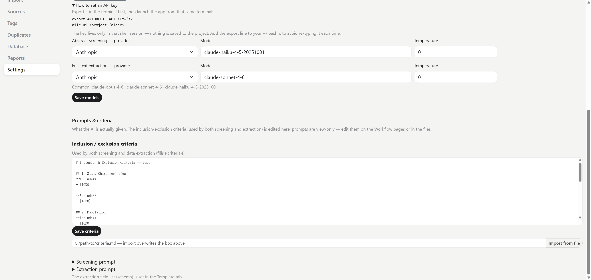

# Core concepts

A few ideas to understand before you start. They explain why the app behaves the way it does.

## Project folder vs. database

| | Folder | Database |
|---|--------|----------|
| Holds | config, prompts, criteria, schema | references, decisions, extractions, audit trail |
| Files | `lit_review.yaml`, `prompts/`, `inclusion_criteria.md`, `schema.yaml` | SQLite file (default) or PostgreSQL |
| Shared by a team? | yes — everyone needs the **same folder** | yes — over PostgreSQL |

The config that defines *how* the review runs lives in the folder; the data the review *produces* lives in the database. One database can hold **many projects**, namespaced by project name.

## The config file: `lit_review.yaml`

Most settings are editable from the **Settings** and **Workflow** pages, but they all land in `lit_review.yaml`. The config is assembled in four layers (low → high precedence):

1. Built-in defaults
2. A built-in **mode preset** (`strict` or `assisted`; skipped for `custom`)
3. An optional user preset file
4. Your project's own `lit_review.yaml`

So you only need to write the fields you want to override; everything else inherits.

## Workflow modes

Each review picks a workflow for the two human-in-the-loop stages. These are the single most important choice because they decide **who reviews what** and **what is hidden from whom**.

### Screening (title & abstract)

| Workflow | Who | Blinding |
|----------|-----|----------|
| `assisted` | AI + **1 human** | both blinded to each other (PRISMA-trAIce) |
| `independent` | **2 humans** | blinded to each other; AI optional reference (Cochrane) |

### Extraction (full text)

| Workflow | Who | Blinding |
|----------|-----|----------|
| `verify` | AI extracts, **human verifies/edits** | AI value shown, human edits it |
| `independent` | **human extracts blind** | AI hidden until the human submits |

You can change a stage's workflow on its **Workflow** page at any time.

## Blinding

To keep the second reviewer honest, the app hides the other reviewer's verdict until you commit your own:

- In `assisted` screening, the **AI's decision is blinded** until you decide.
- In `independent` extraction, the **AI's values are hidden until you submit**.

Disagreements then surface on the **Conflicts** pages for reconciliation.

## Per-stage models

Set one default model in **Settings**, or override it per stage — e.g. a cheaper model for abstract screening and a stronger one for full-text extraction. The top-level `llm:` block is the default; each stage may declare its own `llm:` sub-block that overrides only the fields it sets (the rest inherit). Token usage is logged per call — see **Reports → API usage** to track spend.

```yaml
llm:
  provider: anthropic
  model: claude-sonnet-4-6   # default for every call

screening:
  llm:
    model: claude-haiku-4-5  # cheaper for abstract screening

extraction:
  llm:
    model: claude-opus-4-8   # stronger for full-text extraction
```



## Your domain content

The criteria, prompts, and extraction schema are **yours** — the tool never writes them. They live as files in the project folder and are referenced from `lit_review.yaml`:

| Setting | Default file | What it is |
|---------|--------------|------------|
| `screening.criteria` | `inclusion_criteria.md` | your inclusion/exclusion rules |
| `screening.prompt` | `prompts/screening.txt` | the AI screening prompt |
| `extraction.schema_path` | `schema.yaml` | the variables to extract |
| `extraction.prompt` | `prompts/extraction.txt` | the AI extraction prompt |
| `extraction.codebook` | `codebook.yaml` | optional value definitions |

If you open a prompt file to edit it, leave the markers `{{criteria}}` and `{{schema_md}}` in place — the app fills them in with your criteria and schema at run time (see [How AI extraction works](ai-extraction.md)).

Bibliographic metadata (title, authors, year, journal, DOI) comes from the imported record and is joined into exports by `source_id` — the AI only extracts what the **full text** adds.

## How AI extraction works

Designing an extraction has **two halves you plan together**: the **template** (which variables to pull out) and the **prompt** (how to read the paper and fill them well). Thinking about one means thinking about the other — a field is only as good as the instruction that fills it, and an instruction needs to know what it is filling.

You don't have to worry about output format. When the AI runs, the app **constrains its answer into your exact JSON structure** — your field names, types, and shapes — so a result is always well-formed, with every value paired to a verbatim quote. The prompt then only affects *how well* each field is filled, never the shape.

So the two are **complementary in design but independent in mechanism**: plan them together, but know that the prompt can never change the structure. This split is worth understanding before you customize anything — see **[How AI extraction works](ai-extraction.md)**.
