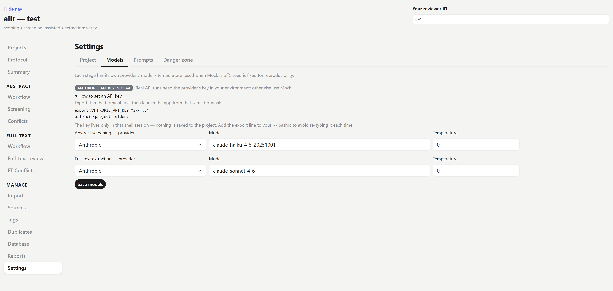

# Core concepts

A few ideas to understand before you start. They explain why the app behaves the way it does.

## Project folder vs. database

| | Folder | Database |
|---|--------|----------|
| Holds | config, prompts, criteria, schema | references, decisions, extractions, audit trail |
| Files | `lit_review.yaml`, `prompts/`, `criteria.yaml`, `schema.yaml` | SQLite file (default) or PostgreSQL |
| Shared by a team? | yes, everyone needs the **same folder** | yes, over PostgreSQL |

The config that defines *how* the review runs lives in the folder; the data the review *produces* lives in the database. One database can hold **many projects**, namespaced by project name.

## The config file: `lit_review.yaml`

Most settings are editable from the **Settings**, **Protocol**, and **Workflow** pages, but they all land in `lit_review.yaml`. The config is assembled in four layers (low → high precedence):

1. Built-in defaults
2. A built-in **mode preset** (`strict` or `assisted`; skipped for `custom`)
3. An optional user preset file
4. Your project's own `lit_review.yaml`

So you only need to write the fields you want to override; everything else inherits.

## Workflow modes

Each review picks a workflow for **each of the three human-in-the-loop stages**. These are the single most important choice because they decide **who reviews what** and **what is hidden from whom**.

### Screening (title & abstract)

| Workflow | Who | Blinding |
|----------|-----|----------|
| `assisted` | AI + **1 human** | both blinded to each other (PRISMA-trAIce) |
| `independent` | **2 humans** | blinded to each other; AI optional reference (Cochrane) |

### Screening (full text)

The same two options, set **separately** from the abstract stage. Leave it unset and it follows the abstract stage.

| Workflow | Who | Blinding |
|----------|-----|----------|
| `assisted` | AI + **1 human** | the AI's verdict comes from AI extraction's per-criterion `flag_check`, so extraction must have run |
| `independent` | **2 humans** | blinded to each other; extraction can come afterwards |

### Extraction (full text)

| Workflow | Who | Blinding |
|----------|-----|----------|
| `verify` | AI extracts, **human verifies/edits** | AI value shown, human edits it |
| `independent` | **human extracts blind** | AI hidden until the human submits |

All three are set on [**Protocol → Workflow**](protocol.md#workflow), and can be changed at any time. The common design is AI-assisted at title and abstract, where the volume is, and two humans at full text, where the stakes are:

```yaml
screening:
  workflow: assisted             # title/abstract
  full_text_workflow: independent  # omit to follow the line above

extraction:
  workflow: independent
```

A stage's workflow also decides when a paper is **settled** there: `independent` needs two human votes, and an unadjudicated disagreement means the stage is not finished. An unsettled paper does not move to the next stage, and PRISMA counts it as neither included nor excluded.

## Blinding

To keep the second reviewer honest, the app hides the other reviewer's verdict until you commit your own:

- In `assisted` screening, the **AI's decision is blinded** until you decide.
- In `independent` extraction, the **AI's values are hidden until you submit**.

Disagreements then surface on the **Conflicts** pages for reconciliation.

## Per-stage models

Each stage runs on its own model, set in **Settings → Models**. There is no built-in default: model names date quickly, so ailr asks you to name the one you want rather than shipping a stale choice. Screening sees every record you import, so a cheap, fast model there saves the most; extraction reads whole papers, so it is worth a strong one. Token usage is logged per call; see **Reports → API usage**. Tokens only, not money: prices change faster than the package ships, so multiply by your provider's current rates.

The top-level `llm:` block holds the defaults both stages inherit; each stage may declare its own `llm:` sub-block that overrides only the fields it sets.

```yaml
llm:
  provider: anthropic        # anthropic | openai | gemini

screening:
  llm:
    model: <a cheap model>   # abstract screening
  workers: 4                 # parallel AI calls (default 4; set 1 for one-at-a-time)

extraction:
  llm:
    model: <a strong model>  # full-text extraction
  workers: 2                 # parallel AI calls (default 2; full-paper prompts are large)
```

AI runs make several calls **in parallel** (`workers` above), which shortens large runs considerably. If your API plan has tight rate limits, lower it. A rate-limited call is retried automatically with backoff, so nothing is lost either way.



## Your domain content

The criteria, variables, and prompts are **yours**; the tool never writes them. The **criteria** and **variables** are *shared definitions* you set once on the [**Protocol**](protocol.md) page; the **prompts** are per-stage. All are stored as files in the project folder and referenced from `lit_review.yaml`:

| Your content | File | Edited on |
|---|---|---|
| inclusion/exclusion **criteria** (structured, shared by both stages) | `criteria.yaml` | **Protocol → Criteria** |
| extraction **variables** (the fields to extract) | `schema.yaml` (+ `extraction_variables.json` mirror) | **Protocol → Variables** |
| the **screening prompt** | `prompts/screening.txt` | **Abstract → Workflow → Prompt** |
| the **extraction prompt** | `prompts/extraction.txt` | **Full text → Workflow → Prompt** |
| optional value definitions | `codebook.yaml` | n/a |

The structured criteria (`criteria.yaml`) are the single source of truth. Because both stages reference the criteria by the same locked IDs, every AI decision is recorded **per criterion** (PASS / FAIL / UNCERTAIN, with reason and quote). See [Set up your protocol](protocol.md).

If you open a prompt file to edit it, leave the markers `{{criteria}}` and `{{schema_md}}` in place; the app fills them in with your criteria and schema at run time (see [How AI extraction works](ai-extraction.md)).

Bibliographic metadata (title, authors, year, journal, DOI) comes from the imported record and is joined into exports by `source_id`; the AI only extracts what the **full text** adds.

## How AI extraction works

Designing an extraction has **two halves you plan together**: the **template** (which variables to pull out) and the **prompt** (how to read the paper and fill them well). Thinking about one means thinking about the other: a field is only as good as the instruction that fills it, and an instruction needs to know what it is filling.

You don't have to worry about output format. When the AI runs, the app **constrains its answer into your exact JSON structure** (your field names, types, and shapes), so a result is always well-formed, with every value paired to a verbatim quote. The prompt then only affects *how well* each field is filled, never the shape.

So the two are **complementary in design but independent in mechanism**: plan them together, but know that the prompt can never change the structure. This split is worth understanding before you customize anything. See **[How AI extraction works](ai-extraction.md)**.
