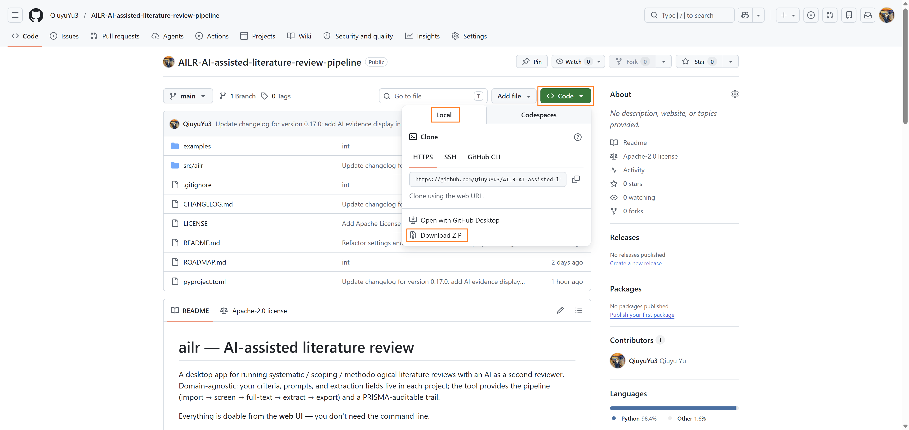
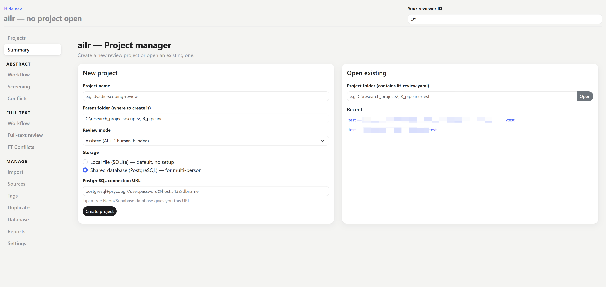
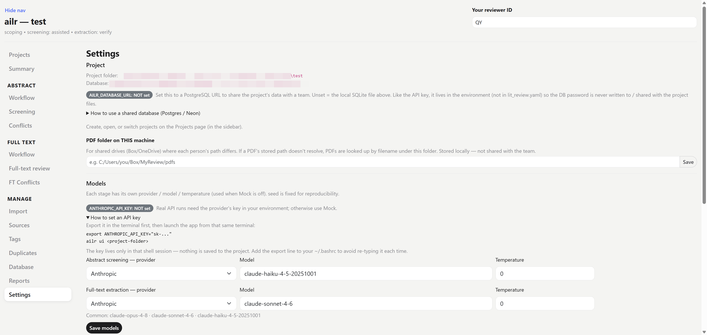

# Getting started

This page takes you from a blank computer to a running app. You will: install Python, create a private environment for ailr, install ailr into it, then start the app and create your first project.

## 1. Install Python

ailr runs on **Python 3.11 or newer**. To check whether you already have it, open a **terminal** (Windows: *PowerShell* or *Git Bash*; macOS: *Terminal*) and type:

```bash
python --version
```

If it prints `Python 3.11` or higher, you're set. If the command isn't found or the version is older, download the latest Python from [python.org/downloads](https://www.python.org/downloads/). On Windows, **tick "Add Python to PATH"** on the first screen of the installer — without it, the `python` command won't be found later.

## 2. Get the ailr code

ailr is installed from its source folder, so first you need the code on your computer. There are two ways to get it — if you're not sure, use the ZIP.

### Option A — Download the ZIP (no extra tools needed)

1. Open the ailr page on GitHub: [AILR repository](https://github.com/QiuyuYu3/AILR-AI-assisted-literature-review-pipeline).
2. Click the green **Code** button, then **Download ZIP**.
3. **Unzip** the downloaded file somewhere you'll remember (e.g. your Documents folder). You'll get a folder named something like `AILR-AI-assisted-literature-review-pipeline`.



### Option B — Clone with git (if you already have git)

```bash
git clone https://github.com/QiuyuYu3/AILR-AI-assisted-literature-review-pipeline.git
```

### Then move into the folder

Open a terminal and **change into that folder** — everything from here runs from inside it:

```bash
cd path/to/AILR-AI-assisted-literature-review-pipeline
```

:::{tip}
Not sure how to write the folder path? `cd` means *change directory*. Type `cd ` (with a trailing space), then **drag the unzipped folder from your file explorer onto the terminal window** — it pastes the full path for you — and press Enter.
:::

## 3. Create a virtual environment

A **virtual environment** is a private box that holds the packages ailr needs, kept separate from the rest of your computer so nothing clashes. Create one (named `.venv`) — you do this once:

```bash
python -m venv .venv
```

Then **activate** it. This is the step people most often forget, and you repeat it every time you open a new terminal to work on ailr:

| Your terminal | Activation command |
|---|---|
| Windows — PowerShell | `.venv\Scripts\Activate.ps1` |
| Windows — Git Bash | `source .venv/Scripts/activate` |
| macOS | `source .venv/bin/activate` |
| Linux | `source .venv/bin/activate` |

When it's active you'll see `(.venv)` at the start of the prompt. (To leave it later, type `deactivate`.)

:::{tip}
On Windows we recommend **Git Bash** over PowerShell — the commands match the macOS / Linux ones throughout this handbook, so you can follow along without translating anything.
:::

## 4. Install ailr

With the environment active, install ailr and its optional features:

```bash
pip install -e ".[llm,pdf]"
```

The **web UI and PostgreSQL support are built in** (core dependencies). The optional extras are:

| Extra | What it adds |
|-------|--------------|
| `llm` | AI provider SDKs (Anthropic, OpenAI, Gemini) |
| `pdf` | PDF → markdown conversion |

`[ui]` and `[postgres]` still work as no-op aliases.

**The `llm` extra is what makes the real AI callable** — it installs the provider SDKs that talk to Anthropic / OpenAI / Gemini. Install without it and ailr still runs, but only in **Mock** mode (placeholder values, no real calls). Keep `[llm]` in the command above unless you only ever intend to use Mock.

## 5. Start the app and create a project

With the environment active, start the app with **no folder** to open the **project manager**:

```bash
ailr ui
```

This opens ailr in your browser at <http://localhost:8050>.



The **project manager** is your home base — it appears whenever you launch `ailr ui` without naming a folder, and from here you set up or reopen a review:

- **Create a new project** — give it a name, then choose where its data lives: a **local SQLite file** (just you — the simplest choice, and the right one to start) or a **PostgreSQL** database URL (a shared project for a team — see [Working as a team](team.md)). ailr builds the project **folder** for you, pre-filled with starter config, a `prompts/` folder, and the `data/` subfolders for PDFs and converted text.
- **Open a recent project** — pick any project you've opened before from the list, so you don't have to remember where on disk it lives.

Once a project exists, you can also reopen it directly by pointing the app at its folder:

```bash
ailr ui <project-folder>
```

Prefer the command line? `ailr init my-review` creates the same project folder without opening the app.

## What's in the project folder

Creating a project drops a few starter files into the folder. They are **yours to edit** — ailr fills them with a template just so nothing is blank; the criteria, prompts, and fields are what you replace with your own review's specifics (your own AI can help you draft them). Most are editable from inside the app, so you rarely open them by hand.

| File / folder | What it's for | Where you edit it |
|---|---|---|
| `lit_review.yaml` | the project's settings — workflow modes, which AI model to use, and where the other files live | **Settings** / **Workflow** pages |
| `inclusion_criteria.md` | your inclusion / exclusion rules, in plain text; the screening prompt refers to these | a text editor, or the screening setup |
| `prompts/screening.txt` | the instruction the AI follows when screening titles & abstracts | **Abstract → Workflow → AI screening** |
| `prompts/extraction.txt` | the instruction the AI follows when extracting data from full text | **Full text → Workflow → Template** |
| `schema.yaml` | the **fields** to extract — the structure of your extraction | **Template** page (a visual editor) |
| `data/raw/` | holds the reference files you import | — |
| `data/pdfs/` | export your Zotero PDFs here — they're auto-linked when you open the full-text pages | — |
| `data/markdown/` | holds the full text converted from PDF to markdown | — |

For a local (SQLite) project, your data also lands here as `data/review.sqlite`. On a PostgreSQL project that data lives in the shared database instead, not in the folder — see [Core concepts](concepts.md).

:::{note}
You do not have to understand these files to use ailr — the app reads and writes them for you. This table is just so the folder isn't a mystery if you open it.
:::

## Set an API key

:::{important}
The AI is only callable when **both** are true: you installed the **`llm` extra** (Step 4) **and** the **API key is set** in the terminal you launch from. Miss either one and ailr runs in **Mock** mode only — it will not make real provider calls.
:::

To run the real AI (not the built-in **Mock**), export the provider's API key in the **same terminal** before launching, then start the app from that terminal so the child process inherits it:

```bash
export ANTHROPIC_API_KEY="sk-ant-..."   # OpenAI: OPENAI_API_KEY · Gemini: GEMINI_API_KEY
ailr ui <project-folder>
```

:::{important}
The key lives only in that shell session — it is gone when you close the terminal. **Nothing is written to the project folder or database.** To avoid re-typing it each session, add the `export` line to your `~/.bashrc`. The **Settings** page shows `ANTHROPIC_API_KEY: set` once it is in the environment.
:::



You can always work without a key using **Mock** mode, which fabricates schema-shaped values so you can click through the whole UI with no API call and no token cost.

## Enter your reviewer ID

Each person enters their own **reviewer ID** at the top of the app before they start reviewing. It is stamped onto every decision and extraction, which is what makes inter-rater reliability (Cohen's κ) and the audit trail possible — so set it once per session and keep it consistent.

- In `assisted` mode, the queue **divides the work** — each paper is screened by one human, and a second vote on an already-screened paper is rejected.
- In `independent` mode, **both humans review every paper**, then reconcile.

:::{tip}
On a shared (PostgreSQL) project, the reviewer ID is how the app tells teammates apart and splits the queue. Pick a stable handle (e.g. your initials) and reuse it. See [Working as a team](team.md).
:::

## What a project is

A project is a **folder** plus a **database**:

- The **folder** holds your configuration — `lit_review.yaml`, prompts, criteria, and the extraction schema.
- The **database** holds your data — references, decisions, extractions, and the audit trail. By default this is a local SQLite file inside the folder; set `storage.database_url` in `lit_review.yaml` to a PostgreSQL database to share it with a team.

See [Core concepts](concepts.md) for the details, then start [importing references](workflow/import.md).
