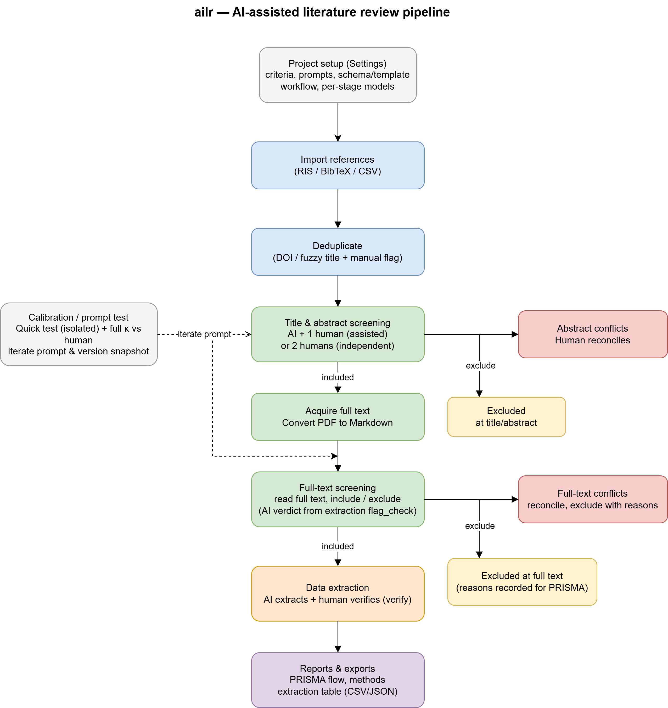

# Internals

For maintainers and the curious. How the package is laid out, how config is assembled, and how the audit trail is built. You do not need any of this to run a review.

## Package layout

```
ailr/
  cli.py            Typer entry point (all commands)
  exceptions.py     custom exceptions caught at the CLI/UI boundary
  core/             config, project, database, source, audit
  ingest/           RIS / BibTeX / CSV readers, dedup, PDF linking, results import
  preprocess.py     PDF → markdown
  tasks/            screen / extract / calibrate / preprocess — the pipeline steps
  llm/              provider-agnostic client: base, factory, retry, mock, providers/
  modes/            built-in config presets (strict.yaml, assisted.yaml)
  exports/          prisma, methods, tables, ris
  metrics.py        Cohen's κ, confusion matrix
  reviewers.py      reviewer identity helpers
  ui/               Dash app — one *_view.py per sidebar page, plus ai_runner
```

Rough data flow:

> **ingest → (preprocess) → tasks → core/database → exports**, with `llm/` called by the tasks and `ui/` driving everything.

The UI is a thin layer: each sidebar page is a `*_view.py`, and AI runs are dispatched through `ui/ai_runner.py` so the same task code backs both the UI and the CLI.

## Config assembly

`core/config.py` builds the effective config with a four-tier deep merge (low → high precedence):

1. pydantic field defaults
2. built-in mode preset (`modes/strict.yaml` or `assisted.yaml`; skipped when `mode == "custom"`)
3. optional user preset file (`mode_preset` in the project config, or `--preset`)
4. the project's own `lit_review.yaml`

Per-stage LLM overrides are resolved separately: `resolve_stage_llm()` layers a stage's `llm:` sub-block over the top-level `llm:` block, so a stage inherits any field it doesn't set. The config is validated into pydantic models (`Config`, `ScreeningConfig`, `ExtractionConfig`, …); a bad file raises `ConfigError`, which the CLI/UI catches and presents cleanly.

## Database

The data layer is **SQLAlchemy Core** (`core/database.py`), so the same schema runs on **SQLite** (default, a file in the project) and **PostgreSQL** (shared, via `storage.database_url` in `lit_review.yaml`). The tables:

| Table | Holds |
|-------|-------|
| `projects` | one row per project (name, config hash) — namespaces everything else |
| `sources` | imported references + metadata, `pdf_path`, `markdown_path`, duplicate flag |
| `screening_decisions` | every abstract/full-text verdict (AI and human), with reasoning, evidence, confidence, `prompt_version` |
| `extractions` | one row per extracted field, with `source_quote`, page/section, `prompt_version` |
| `reconciliations` | conflict resolutions — links the AI and human decisions and records the final value + rationale |
| `prompt_versions` / `codebook_versions` | snapshots of prompts/codebook so each decision traces to the exact wording |
| `tags` / `source_tags` | labels and their many-to-many links to sources |
| `screening_actions` | per-source action log (move to/from a stage, undo) |
| `notes` | free-text notes on a source |
| `duplicates` / `exclusion_reasons` | dedup pairs and recorded exclusion reasons (feed the PRISMA flow) |
| `calibration_samples` | which sources are in each calibration sample |
| `api_calls` | token usage per LLM call (drives the API-usage report) |
| `test_runs` / `test_decisions` / `test_extractions` | isolated calibration "quick test" runs — kept separate from real decisions |

## The audit trail

The primary audit trail is the **database itself**:

- `screening_decisions` and `extractions` are **append-only** and stamped with `reviewer_type` / `reviewer_id` (or `extractor_*`), `timestamp`, `llm_params`, and `prompt_version`. Nothing is overwritten in place — a changed verdict is a new row.
- `reconciliations` records *who* adjudicated a conflict and *why*.
- `prompt_versions` / `codebook_versions` make every decision reproducible against the exact prompt that produced it.
- `api_calls` accounts for every token spent.

Together these let the **exports** module derive a PRISMA flow, a methods skeleton, and inter-rater reliability entirely from stored rows.

**JSONL backup.** Alongside the database, every decision and extraction is also appended to a plaintext log at `data/audit.jsonl` (path from `logging.audit_log`). This is a deliberate *second* copy — the database stays the primary store, and the JSONL write is **best-effort**: `core/audit.py`'s `log_event` swallows I/O errors so a failed log line can never break the primary DB write. It means the trail survives even if the database is lost, and `read_events()` can replay it.

## Exports & metrics

`exports/` turns stored rows into reporting artifacts — `prisma.py` (flow counts), `methods.py` (methods prose), `tables.py` (CSV/JSON extraction table), `ris.py` (included set back to RIS). `metrics.py` computes Cohen's κ and the confusion matrix from paired decisions, used both in calibration and on the Reports page.

## CLI reference

Everything below is also doable from the UI — the CLI is the power-user bypass, useful for scripting or batch runs.

| Command | Does |
|---------|------|
| `ailr init <name>` | create a new project folder |
| `ailr ui [folder]` | launch the web app (no folder → project manager) |
| `ailr ingest <project> <file>` | import RIS / BibTeX / CSV references |
| `ailr import-pdfs <project> <ris>` | link PDFs from a Zotero RIS export |
| `ailr preprocess <project>` | convert linked PDFs to markdown |
| `ailr screen <project>` | run AI abstract screening |
| `ailr calibrate <project> --stage screening` | calibrate a prompt (κ vs. human) |
| `ailr extract <project>` | run AI data extraction |
| `ailr metrics <project>` | inter-rater reliability and stats |
| `ailr export <project> --format csv` | export the dataset (csv / json / ris) |
| `ailr prompt-bump <project>` | snapshot a new prompt version |
| `ailr db-migrate <project> --to <url>` | copy a SQLite project into Postgres |

Add `--mock` to `screen` / `extract` / `calibrate` to run with no API call. Run `ailr <command> --help` for all options.

## Pipeline diagram

The full flow — main path plus the conflict, calibration, and exclusion branches — is shown on the [handbook home page](index.md).


