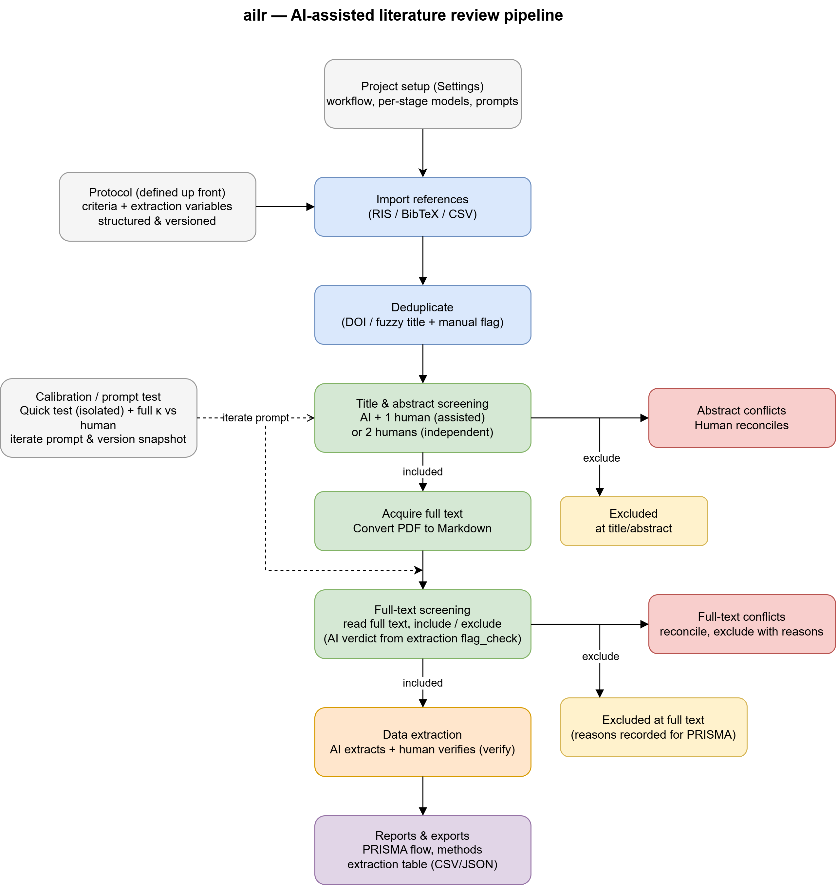

# Internals

For maintainers and the curious. How the package is laid out, how config is assembled, and how the audit trail is built. You do not need any of this to run a review.

## Package layout

```
ailr/
  cli.py            Typer entry point (all commands)
  exceptions.py     custom exceptions caught at the CLI/UI boundary
  core/             config, project, source, audit, and the database (see below)
  ingest/           RIS / BibTeX / CSV readers, dedup, PDF linking, results import
  preprocess.py     PDF → markdown
  criteria.py       structured inclusion/exclusion criteria (criteria.yaml → {{criteria}})
  extraction.py     schema → tool definition; unwrap tool call → rows
  quote_audit.py    matches stored quotes against the paper markdown (coverage / verbatim)
  crosschecker.py   LLM cross-checker: judges an existing record (not a Reviewer — it extracts nothing)
  crosscheck_prompt.txt  the built-in cross-check prompt; a project may override it
  crosscheck_screening_prompt.txt  the same, for the screening cross-check
  tasks/            screen / extract / calibrate / crosscheck / preprocess: the pipeline steps
  llm/              provider-agnostic client: base, factory, retry, mock, providers/
  modes/            built-in config presets (strict.yaml, assisted.yaml)
  exports/          prisma, methods, tables, ris, reliability (raw votes CSV)
  metrics.py        Cohen's κ, confusion matrix
  reviewers.py      reviewer identity helpers
  ui/               Dash app: one *_view.py per sidebar page, plus shared parts (see below)
```

`core/database.py` is a **facade**: the `Database` class is assembled from per-domain mixins that each hold their own SQL, `_db_sources.py`, `_db_screening.py` (+ `_db_screening_aux.py`), `_db_extraction.py`, `_db_crosscheck.py`, `_db_calibration.py`, `_db_admin.py`, with the table definitions in `_db_schema.py`. Call sites only ever see `project.db`.

The deterministic cross-check lives in `core/crosscheck.py` (extraction) and `core/crosscheck_screening.py` (screening), both reusing `quote_audit.py` for the matching itself rather than reimplementing it; `tasks/crosscheck.py` walks (source, record-owner) pairs once and subclasses supply what the records are, what text they are judged against, and whether the check is the free one or the LLM call. That is how the same walk serves both stages, and how the calibration rehearsal reuses it against the quick-test tables. Screening findings share the `cross_checks` table, distinguished by `stage` and pointing at a `screening_decisions` row rather than an `extractions` row — which is why staleness is resolved per stage.

The `ui/` package is the same idea. Each sidebar page is a `*_view.py`, and the parts more than one page needs live beside them: `modals.py` (shared dialogs), `_cards.py` (the record card), `_actions.py`, `_common.py`, `_project.py` (project loading), `version_ui.py` (the version/diff widgets), and `ai_runner.py`.

Rough data flow:

> **ingest → (preprocess) → tasks → core/database → exports**, with `llm/` called by the tasks and `ui/` driving everything.

The UI is a thin layer: AI runs are dispatched through `ui/ai_runner.py`, so the same task code backs both the UI and the CLI.

## Config assembly

`core/config.py` builds the effective config with a four-tier deep merge (low → high precedence):

1. pydantic field defaults
2. built-in mode preset (`modes/strict.yaml` or `assisted.yaml`; skipped when `mode == "custom"`)
3. optional user preset file (`mode_preset` in the project config, or `--preset`)
4. the project's own `lit_review.yaml`

Per-stage LLM overrides are resolved separately: `resolve_stage_llm()` layers a stage's `llm:` sub-block over the top-level `llm:` block, so a stage inherits any field it doesn't set. Screening workflows go through one resolver, `Config.screening_workflow(stage)`, since the full-text stage may override the abstract one (`screening.full_text_workflow`). Each stage also has a `workers` count (`screening.workers` default 4, `extraction.workers` default 2) for parallel AI calls. The config is validated into pydantic models (`Config`, `ScreeningConfig`, `ExtractionConfig`, and so on); a bad file raises `ConfigError`, which the CLI/UI catches and presents cleanly.

**Domain-content files** referenced from the config live in the project folder and are edited in the UI (mostly on the **Protocol** page): `criteria.yaml` (structured criteria, single source of truth, shared by screening and extraction), `schema.yaml` (extraction variables, mirrored to `extraction_variables.json`), `prompts/screening.txt` / `prompts/extraction.txt` (the fixed scaffolds), and `prompts/extraction_additional.txt` (`{{additional}}`). Criteria, variables, and prompts are **versioned**: each save snapshots a new version (prompts store the fully-resolved `composed` text), so a decision traces to the exact wording in force.

## Database

The data layer is **SQLAlchemy Core** (`core/database.py`), so the same schema runs on **SQLite** (default, a file in the project) and **PostgreSQL** (shared, via `storage.database_url` in `lit_review.yaml`). The tables:

| Table | Holds |
|-------|-------|
| `projects` | one row per project (name, config hash); namespaces everything else |
| `sources` | imported references + metadata, `pdf_path`, `markdown_path`, duplicate flag |
| `screening_decisions` | every abstract/full-text verdict (AI and human), with reasoning, evidence, confidence, `prompt_version` |
| `extractions` | one row per extracted field, with `source_quote`, page/section, `prompt_version`, and `raw_output` (what the model returned for that field before unwrapping) |
| `reconciliations` | conflict resolutions; links the AI and human decisions and records the final value + rationale |
| `cross_checks` | verification findings against an existing record: `stage`, whose record (`target_type` / `target_id`), the exact row judged (`target_row_id`), the field, the checker, `check_kind` (`deterministic` / `llm`), and the verdict. Advisory only — never read by conflicts, agreement stats, or PRISMA |
| `prompt_versions` / `codebook_versions` | snapshots of prompts/codebook so each decision traces to the exact wording |
| `artifact_versions` | snapshots of criteria, variables, and prompts per save; drives the version diff and the amendment log |
| `tags` / `source_tags` | labels and their many-to-many links to sources |
| `screening_actions` | per-source action log (move to/from a stage, undo) |
| `notes` | free-text notes on a source |
| `duplicates` / `exclusion_reasons` | dedup pairs and recorded exclusion reasons (feed the PRISMA flow) |
| `calibration_samples` | samples drawn by the earlier full calibration; nothing writes it now, kept so older projects keep their data |
| `api_calls` | token usage per LLM call (drives the API-usage report) |
| `test_runs` / `test_decisions` / `test_extractions` | isolated calibration "quick test" runs, kept separate from real decisions |

## The audit trail

The primary audit trail is the **database itself**:

- `screening_decisions` and `extractions` are **append-only** and stamped with `reviewer_type` / `reviewer_id` (or `extractor_*`), `timestamp`, `llm_params`, and `prompt_version`. Nothing is overwritten in place; a changed verdict is a new row.
- `llm_params` records the **decoding settings the decision was actually made under**, model and temperature (and the seed where the provider accepts one), which is what lets the methods export describe the run rather than the current config.
- Re-running the AI on a paper does not delete its previous extraction: those rows are re-typed as **superseded** and kept, which is what the "earlier version" view and the fill-all picker read. A run is reconstructed from the timestamp gaps between rows, since one run writes its fields one at a time.
- `reconciliations` records *who* adjudicated a conflict and *why*.
- `cross_checks` is the one table that is **not** append-only: re-running a check replaces that (source, stage, target, kind) set rather than accumulating, because a finding describes the current state of a record rather than an event. Each row still pins the `target_row_id` it judged, so a finding whose row was since re-extracted reads as **stale** rather than silently applying to a value it never saw.
- `prompt_versions` / `codebook_versions` make every decision reproducible against the exact prompt that produced it.
- `api_calls` accounts for every token spent.

Together these let the **exports** module derive a PRISMA flow, a methods skeleton, and inter-rater reliability entirely from stored rows.

**JSONL backup.** Alongside the database, every decision and extraction is also appended to a plaintext log at `data/audit.jsonl` (path from `logging.audit_log`). This is a deliberate *second* copy: the database stays the primary store, and the JSONL write is **best-effort**. `core/audit.py`'s `log_event` swallows I/O errors so a failed log line can never break the primary DB write. It means the trail survives even if the database is lost, and `read_events()` can replay it.

## Exports & metrics

`exports/` turns stored rows into reporting artifacts: `prisma.py` (flow counts), `methods.py` (methods prose), `tables.py` (CSV/JSON extraction table), `ris.py` (included set back to RIS), `reliability.py` (the raw votes as a wide CSV, so agreement can be recomputed under another convention). `metrics.py` computes Cohen's κ and the confusion matrix from paired decisions, used both in calibration and on the Reports page. `quote_audit.py` sits alongside them: it substring-matches each stored quote against the paper's markdown, and feeds the run summary, the calibration results, and the Reports quote audit.

## CLI reference

Everything below is also doable from the UI. The CLI is the power-user bypass, useful for scripting or batch runs.

| Command | Does |
|---------|------|
| `ailr init <name>` | create a new project folder |
| `ailr ui [folder]` | launch the web app (no folder → project manager) |
| `ailr ingest <project> <file>` | import RIS / BibTeX / CSV references |
| `ailr import-pdfs <project> <ris>` | link PDFs from a Zotero RIS export |
| `ailr preprocess <project>` | convert linked PDFs to markdown |
| `ailr screen <project>` | run AI abstract screening |
| `ailr extract <project>` | run AI data extraction |
| `ailr workflow <project>` | print the three stage workflows; `--stage abstract\|full-text\|extraction --set VALUE` to change one |
| `ailr show disagreements <project>` | AI/human disagreements at one stage (`--stage abstract\|full_text`) |
| `ailr metrics <project>` | inter-rater reliability and stats |
| `ailr export <project> --format csv` | export the dataset (csv / json / ris) |
| `ailr prompt-bump <project>` | snapshot a new prompt version |
| `ailr db-migrate <project> --to <url>` | copy a SQLite project into Postgres |

Add `--mock` to `screen` / `extract` to run with no API call. `screen`, `extract` and `preprocess` exit with code 1 when any paper failed, after printing the summary, so a script can tell. Run `ailr <command> --help` for all options.

**Cross-check is UI-only** and has no command here. It is deliberate: the CLI covers the pipeline steps that predate the UI, and new features are added to the UI rather than to both. Both cross-check layers run from **Full text → Workflow → AI extraction** and, for screening records, from **Abstract → Workflow → AI screening** (mock mode from the same places).

## Pipeline diagram

The full flow (main path plus the conflict, calibration, and exclusion branches) is shown on the [handbook home page](index.md).


