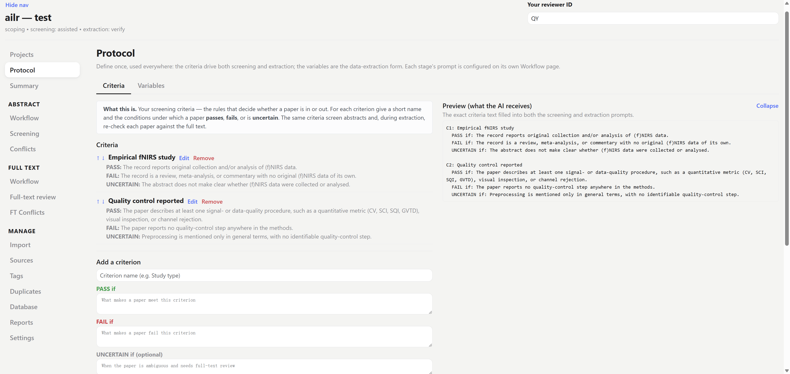
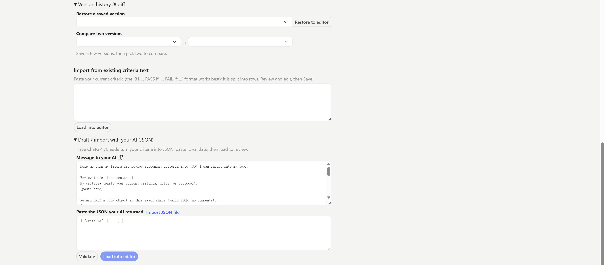
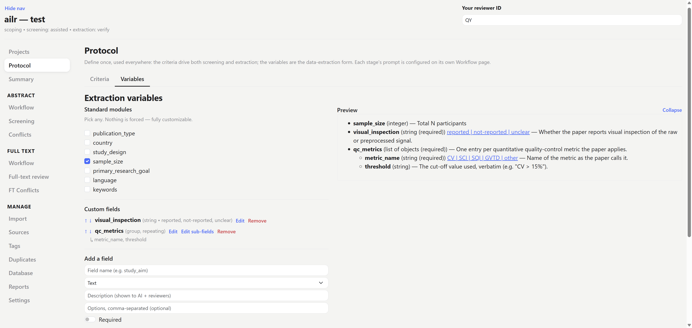
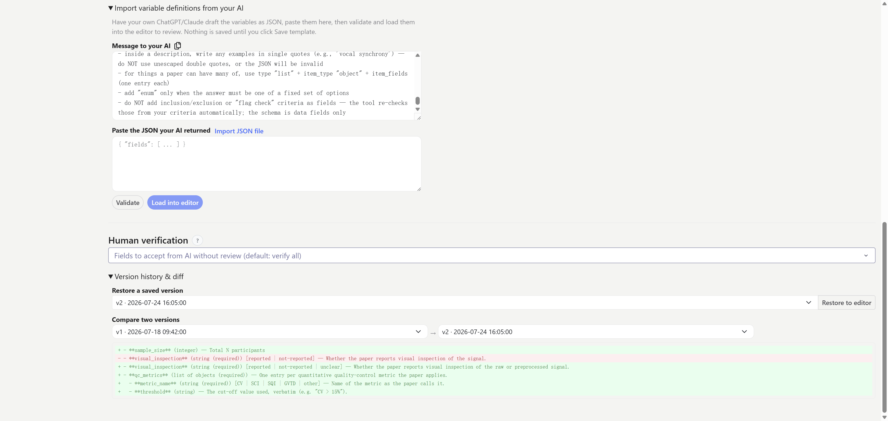
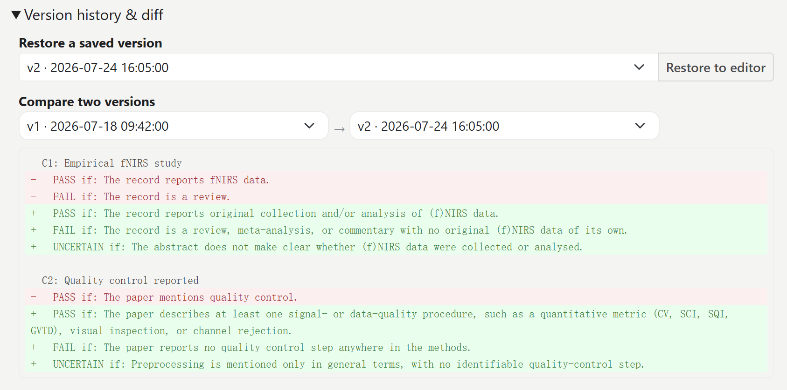

# Set up your protocol

The **Protocol** page (top of the sidebar, right after Projects) holds your review's **shared definitions**: the **criteria** and the **extraction variables**. You set these up *once*, near the start, because everything downstream depends on them. The criteria drive both screening and extraction, and the variables are the data-extraction form.

:::{tip}
If you would rather start from something concrete, the repository's [`examples/`](https://github.com/QiuyuYu3/AILR-AI-assisted-literature-review-pipeline/tree/main/examples) folder holds a small complete set: criteria, variables, and both prompts, in both the YAML the app writes and the JSON the importers read.
:::

> Define once, used everywhere. Each *stage's prompt* is configured separately on its own Workflow page. Protocol is just the definitions.

## Criteria

Your inclusion/exclusion rules live here as a **structured form**: each criterion has a name and its **PASS / FAIL / UNCERTAIN** rules. When you save them, each criterion gets a **locked ID**.

Those IDs are what make decisions auditable end to end:

- **Both stages reference the same criteria by ID.** Abstract screening and full-text extraction re-check the *same* named criteria, so a paper is judged against one consistent rule set.
- **Every AI decision is recorded per criterion.** For each paper the AI reports a **PASS / FAIL / UNCERTAIN verdict, a confidence, and a supporting quote for each criterion**, not just an overall include/exclude. You can see exactly *why* it decided, on the Screening, Conflicts, and Calibration views.

To fill the criteria in, type them in the form, **paste** them, or click **Import JSON file** to load a `criteria.json` you (or your own AI) prepared. It validates and fills the editor for review before you save. The saved criteria (`criteria.yaml`) are the single source of truth: until they exist, screening and extraction run with no criteria at all.

## Variables

The **Variables** tab is the **data-extraction form**: the fields the AI fills for each included paper (the schema). Each field has a name, a **type** (text / number / enum / list / group), a **description**, options for enums, whether it is **required**, and whether a **human must verify** it.

- **Edit any field in place.** Change its name, type, options, or required flag without deleting and re-adding.
- **Import** a field list: paste JSON, or click **Import JSON file** to load `extraction_variables.json`, validate, then load into the editor to review before saving.
- **Save** writes the schema the app runs on (`schema.yaml`) and a re-importable JSON mirror (`extraction_variables.json`).

How these fields become a guaranteed JSON structure, and how to draft them with your own AI, is explained in [How AI extraction works](ai-extraction.md).

:::{tip}
The field **descriptions** do the heavy lifting: the AI reads each one as the label for what to put in that field (and, for an enum, what each option means). A precise description beats a long prompt, so invest here.
:::

## Version history

Criteria, variables, and prompts are all **versioned**. Any change snapshots a new version, and the history view shows a **highlighted diff** so you can compare any two saved versions or **restore** an earlier one. Because the AI's decisions are stamped with the version that produced them, you can always trace a decision back to the exact rules in force at the time. The app also flags papers that were screened or extracted under criteria or prompts that have since changed (see the **AI outdated** badges on the Screening and Full-text pages).

Once your criteria and variables are set, move on to [importing references](workflow/import.md).
