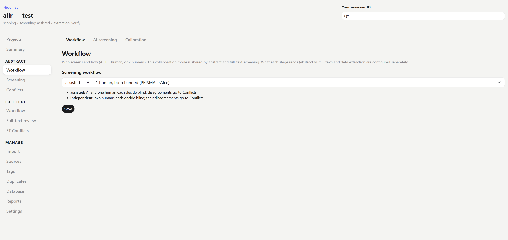
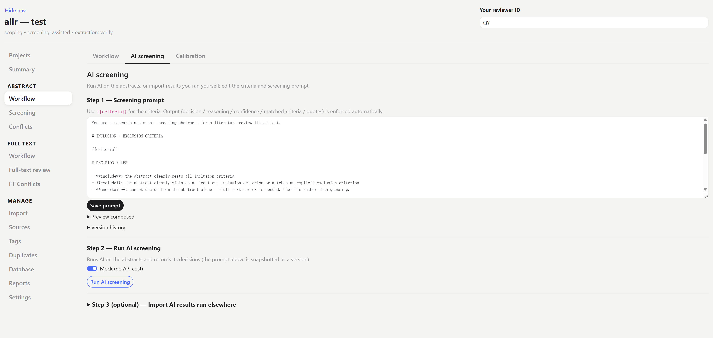
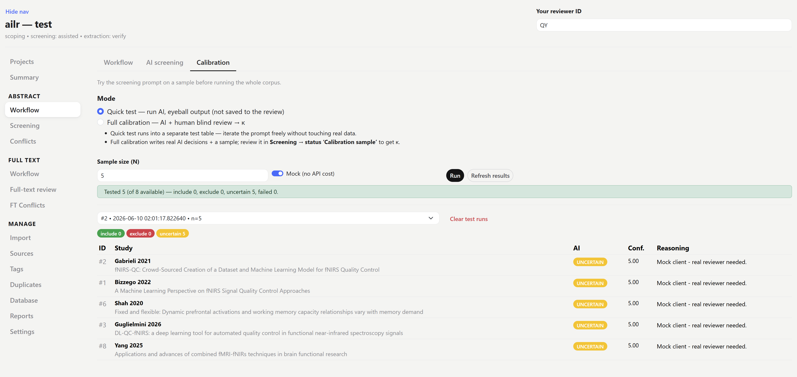
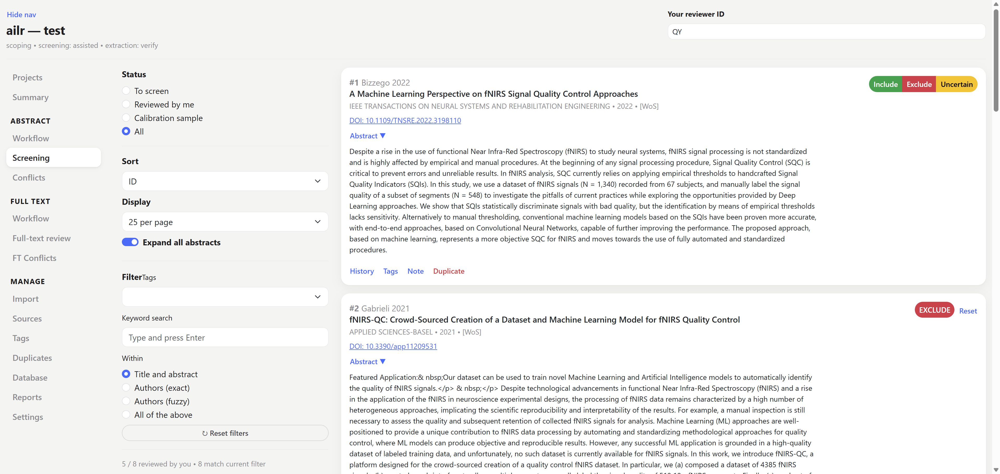
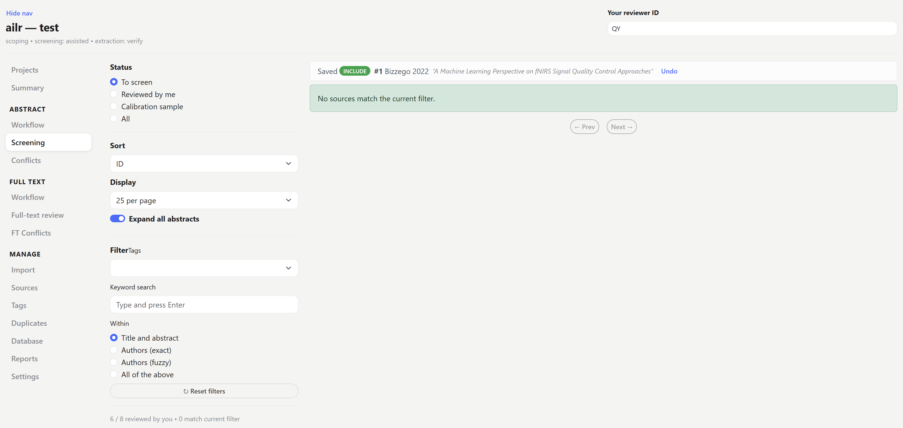
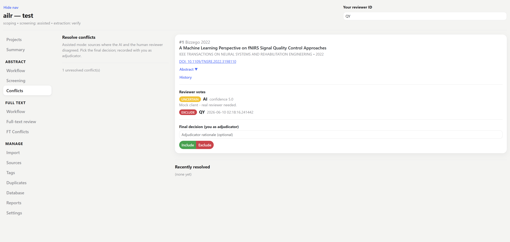

# Abstract screening

Title & abstract screening with the AI as a second reviewer. This is where the bulk of the library is narrowed down, so the workflow is built to keep the two reviewers independent and to let you trust the AI before you rely on it. Sidebar (under **Abstract**): **Workflow**, **Screening**, **Conflicts**.

## 1. Set up the workflow

The **Workflow** page (abstract) has three tabs — **Workflow**, **AI screening**, and **Calibration**:

- **Workflow tab** — choose the screening workflow, `assisted` (AI + 1 human) or `independent` (2 humans). See [workflow modes](../concepts.md#workflow-modes). This decides who reviews what and what stays blinded.
- **AI screening tab** — edit the screening prompt (it is filled with your inclusion criteria) and run the AI.
- **Calibration tab** — test the prompt before committing to it.







### Calibrate the prompt

Calibration tests the prompt on a small sample so you trust it before spending tokens — and trust on the whole library:

- **Quick test** — run the prompt on a few abstracts and read the AI's reasoning, *without* touching your real decisions. Use this while you are still editing the wording. Choose **Random sample** (N) or **Pick specific papers** (search by author / title / DOI / id) to test on cases you care about.
- **Full calibration** — run on a calibration sample and compute **Cohen's κ vs. human** to measure agreement against the target (`target_kappa`, default 0.7). κ near or above the target means the AI is tracking your judgement closely enough to act as a real second reviewer.

Iterate the prompt until agreement is acceptable. Each run snapshots a **prompt version**, so every later decision can be traced back to the exact wording that produced it — you never lose track of which prompt screened which papers.

:::{tip}
If κ is low, read the disagreements rather than just lowering the bar: usually a couple of criteria are ambiguous, and tightening their wording in the prompt fixes far more than a longer prompt would.
:::

## 2. Run AI screening

With a calibrated prompt, use the **AI screening** tab to run screening across the un-screened sources. Use **Mock** if you just want to populate the UI with no API call (e.g. to rehearse the workflow before paying for tokens).

CLI equivalent:

```bash
ailr screen <project-folder> --limit 50        # real AI, first 50
ailr screen <project-folder> --mock            # no API call
```

## 3. Human screening

The **Screening** page is a card list: each paper shows its title and abstract with **Include / Exclude / Uncertain** buttons. Work through the queue at your own pace — the page remembers where you are.

:::{important}
The **AI's decision stays blinded** until you commit yours. This keeps your judgement independent — the whole point of a second reviewer. Only after you decide is the AI's verdict revealed and any disagreement logged.
:::

In `assisted` mode the queue **divides the work** between humans (one human per paper), so two people screening at once never double up. In `independent` mode every human screens every paper, and the two passes are reconciled afterwards.





## 4. Reconcile conflicts

Where the AI and human (or two humans) disagree, the pair appears on the **Conflicts** page. Read both verdicts and their reasoning side by side, then record the final decision — this is the adjudication step that PRISMA expects to be documented. Included papers move on to [full text](full-text.md); excluded papers are counted on the PRISMA diagram with their reason.


