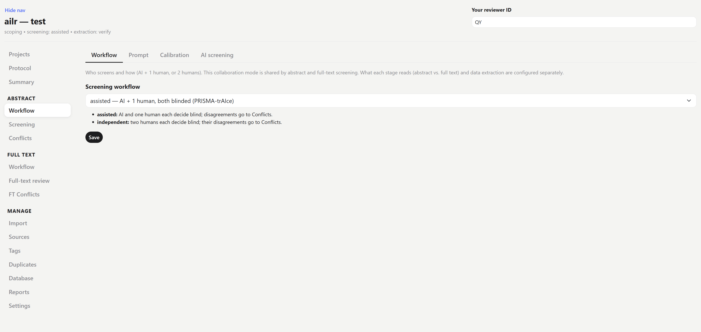
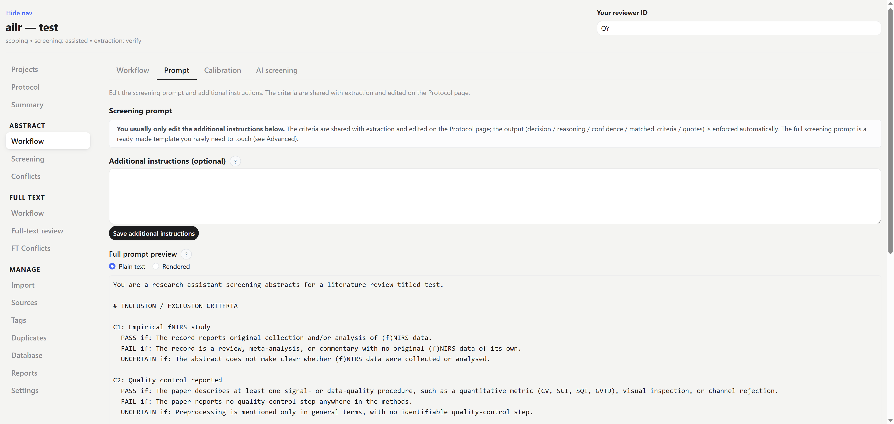
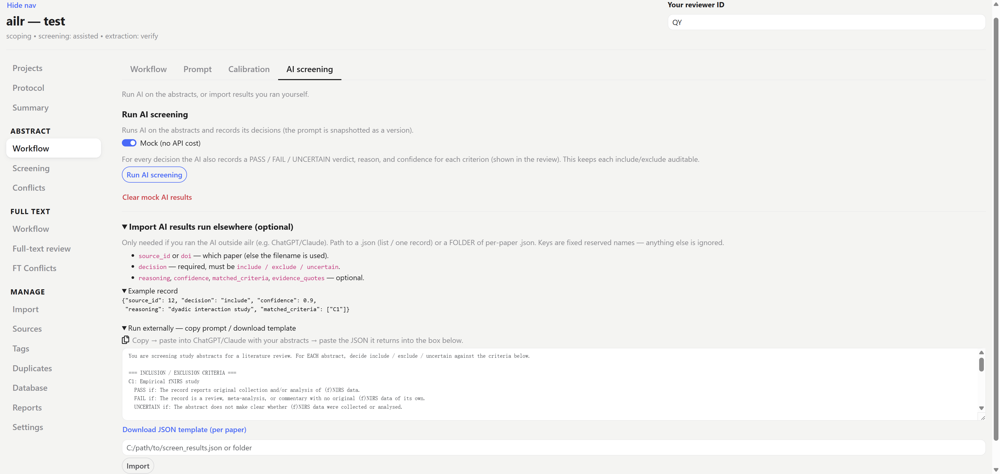
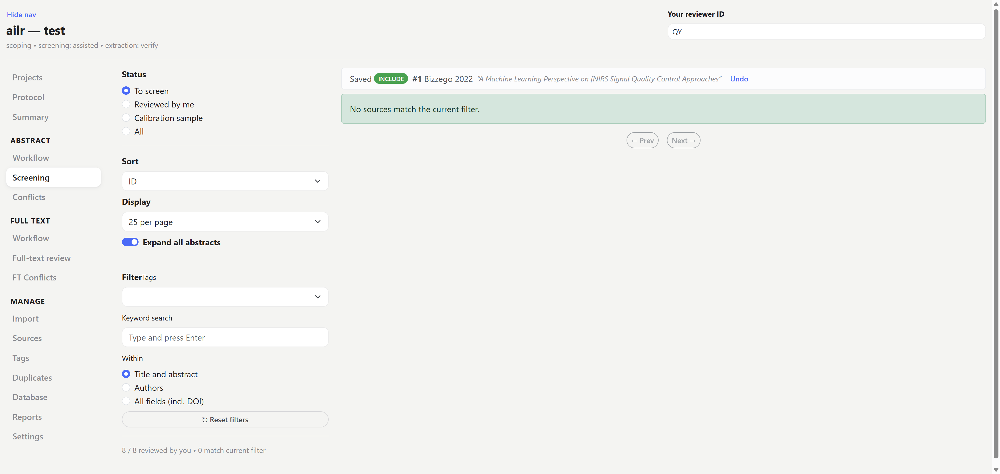
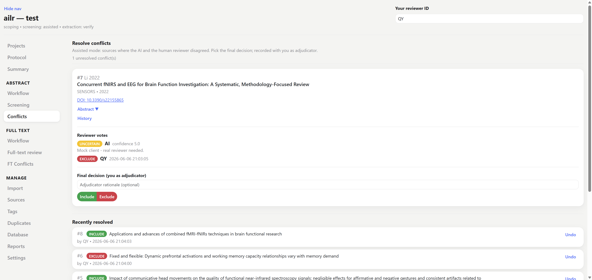

# Abstract screening

Title & abstract screening with the AI as a second reviewer. This is where the bulk of the library is narrowed down, so the workflow is built to keep the two reviewers independent and to let you trust the AI before you rely on it. Sidebar (under **Abstract**): **Workflow**, **Screening**, **Conflicts**.

## 1. Set up the workflow

The **Workflow** page (abstract) has four tabs:

- **Workflow.** Choose the screening workflow, `assisted` (AI + 1 human) or `independent` (2 humans). See [workflow modes](../concepts.md#workflow-modes). This decides who reviews what and what stays blinded.
- **Prompt.** Edit the screening prompt and optional **additional instructions** (stage-specific guidance). Your **criteria** are *not* here: they are shared with extraction and defined once on the [Protocol](../protocol.md) page; the prompt references them via `{{criteria}}`, filled in when the AI runs. A **Full prompt preview** below the editor shows the finished prompt exactly as sent, with the criteria already filled in.
- **Calibration.** Test the prompt on a sample before committing to it (see below).
- **AI screening.** Run the AI, or import results you ran externally.








### Calibrate the prompt

Calibration tests the prompt on a small sample, so you trust it before spending tokens on the whole library:

- **Quick test.** Run the prompt on a few abstracts and read the AI's reasoning, *without* touching your real decisions. Use this while you are still editing the wording. Choose **Random sample** (N) or **Pick specific papers** (search by author / title / DOI / id) to test on cases you care about.
- **Full calibration.** Run on a calibration sample and compute **Cohen's κ vs. human** to measure agreement against the target (`target_kappa`, default 0.7). κ near or above the target means the AI is tracking your judgement closely enough to act as a real second reviewer. The sample is waiting for you under **Screening → status "Calibration sample"**; κ appears once you have decided those records yourself.

Full calibration only appears in `assisted` workflow. Under `independent` two humans decide every record and the AI is a reference rather than a reviewer, so tuning it to agree with one of them would not change who reviews what. Quick test still works for editing the prompt, and the AI's agreement with each reviewer is on the [Reports](reports.md) page.

Iterate the prompt until agreement is acceptable. Each run snapshots a **prompt version**, so every later decision can be traced back to the exact wording that produced it, and you never lose track of which prompt screened which papers.

:::{tip}
If κ is low, read the disagreements rather than just lowering the bar: usually a couple of criteria are ambiguous, and tightening their wording in the prompt fixes far more than a longer prompt would.
:::

## 2. Run AI screening

With a calibrated prompt, use the **AI screening** tab to run screening across the un-screened sources. Use **Mock** if you just want to populate the UI with no API call (e.g. to rehearse the workflow before paying for tokens). The run makes several AI calls in parallel (4 by default; tune with `screening.workers` in `lit_review.yaml`; see [per-stage models](../concepts.md#per-stage-models)).

CLI equivalent:

```bash
ailr screen <project-folder> --limit 50        # real AI, first 50
ailr screen <project-folder> --mock            # no API call
```

## 3. Human screening

The **Screening** page is a card list: each paper shows its title and abstract with **Include / Exclude / Uncertain** buttons. Work through the queue at your own pace; the page remembers where you are.

:::{important}
The **AI's decision stays blinded** until you commit yours. This keeps your judgement independent, the whole point of a second reviewer. Only after you decide is the AI's verdict revealed and any disagreement logged.
:::

In `assisted` mode the queue **divides the work** between humans (one human per paper), so two people screening at once never double up. In `independent` mode every human screens every paper, and the two passes are reconciled afterwards.

Two aids for working through the list: **sort by AI confidence (lowest first)** to surface the papers the AI was least sure about, and an **AI outdated** badge flags any paper the AI screened under criteria or a prompt that have since changed, so you know which to re-run.

:::{note}
When the AI's verdict is revealed, it comes with a **per-criterion breakdown**: for each of your criteria, the AI gives a **PASS / FAIL / UNCERTAIN** verdict with its reason and a supporting quote. So an include/exclude is auditable criterion by criterion, not just a single label. It is the same structured check the full-text stage uses.
:::




## 4. Reconcile conflicts

Where the AI and human (or two humans) disagree, the pair appears on the **Conflicts** page. Read both verdicts side by side. The card shows the AI's **per-criterion** PASS / FAIL / UNCERTAIN verdicts (with confidence and quote) under its rationale, so you can see exactly which criterion drove the disagreement. Then record the final decision. This is the adjudication step that PRISMA expects to be documented. Included papers move on to [full text](full-text.md); excluded papers are counted on the PRISMA diagram with their reason.


