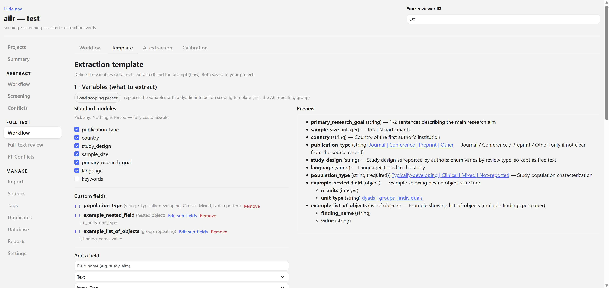
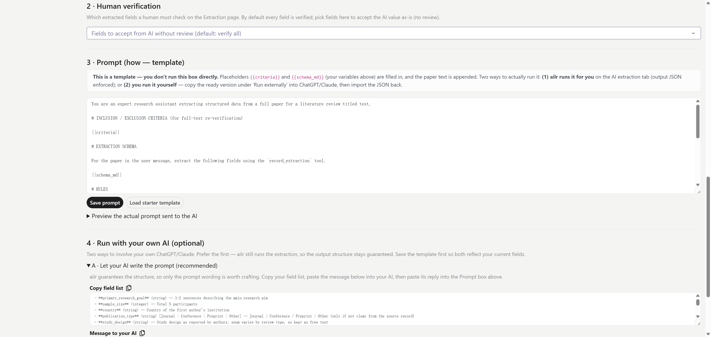
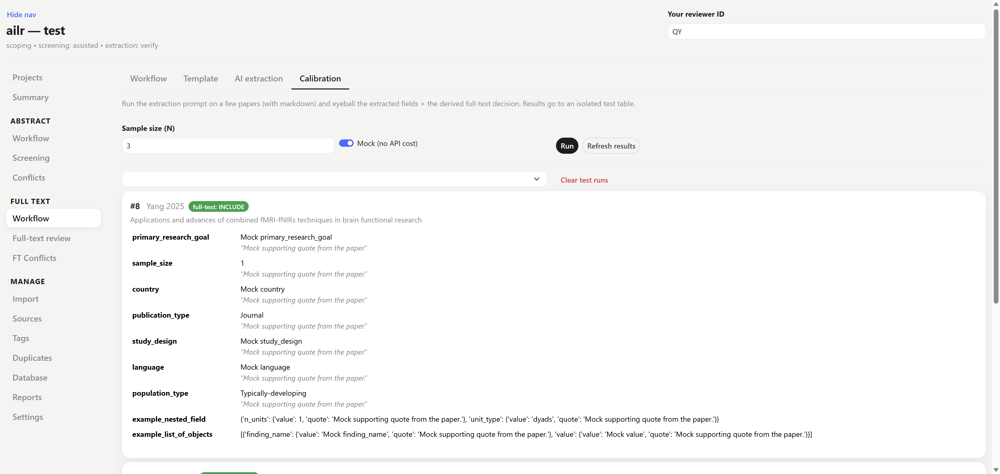
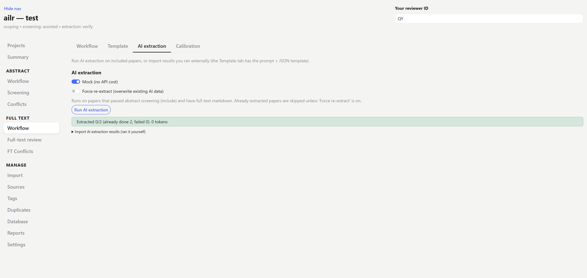
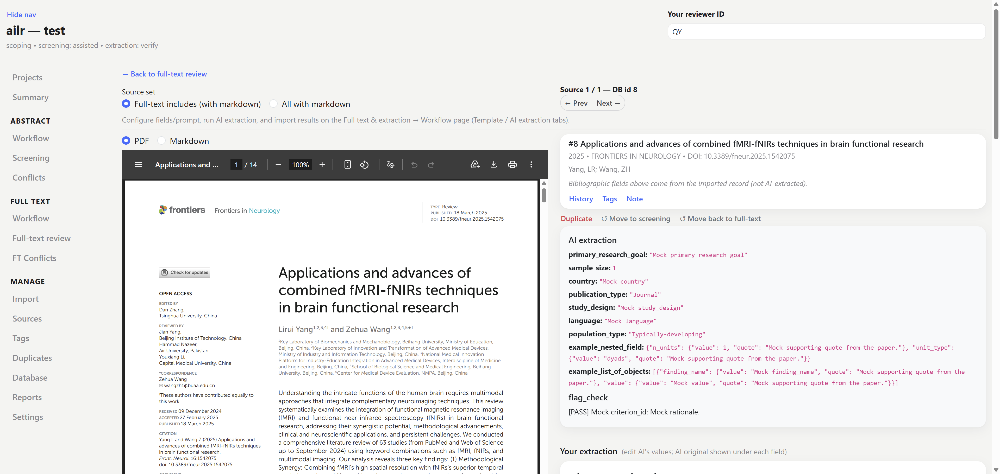
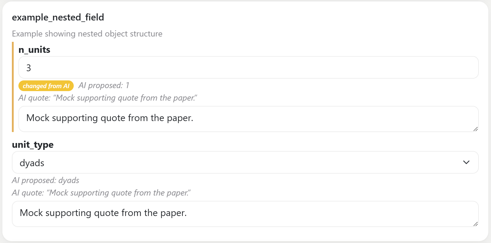

# Data extraction

Pull structured data out of the included full texts — the step that turns a pile of papers into a dataset you can analyse. The setup lives in tabs on the **Full text → Workflow** page, in the order you use them — **Template** (define what to extract), **Calibration** (test on a few papers), and **AI extraction** (run it last) — while the **Extraction** sidebar page is the per-paper verify queue.

## 1. Define the template

On the **Template** tab you set up *what* gets extracted and *how*:

- the **variables** to extract (the schema, `schema.yaml`)
- the **prompt**, broken into the two parts worth editing — the **inclusion/exclusion criteria** and free-form **additional instructions**; the rest is a fixed scaffold ailr fills in (editable under "Advanced")
- which fields a **human must verify**
- optional value definitions (`codebook.yaml`)

You can build the variables by hand, or **import** them — paste a JSON list of field definitions (e.g. one your own AI drafted), **validate** it (the app checks the structure and flags warnings), and load it into the editor to review before saving. Saving the template also writes a re-importable `extraction_variables.json` copy.

The schema sets the *structure* (which fields exist and their types) and the prompt sets the *quality* (how to read the paper) — these are independent, and understanding why is worth a few minutes: see [How AI extraction works](../ai-extraction.md). You can let your own AI draft the **variables** ([Define your variables with your own AI](../ai-extraction.md#define-your-variables-with-your-own-ai)) or, for the fixed scaffold, [rewrite it with your own AI](../ai-extraction.md#rewriting-the-whole-scaffold-advanced); or **download a JSON template** / **copy the extraction prompt** to run the model entirely outside the app ([Run the AI externally](../ai-extraction.md#run-the-ai-externally-and-import)).





:::{tip}
The single highest-leverage thing you can do for extraction quality is to write a **clear description for each field**. The model reads those descriptions as the label for where content goes, so a precise field description beats a long prompt. Use an **enum** wherever the answer should be one of a fixed set.
:::

## 2. Choose the extraction workflow

Set the workflow on the full-text **Workflow** page:

- `verify` — the AI extracts and the **human verifies/edits** each value (the AI value is shown). Fastest path; the human is a checker.
- `independent` — the **human extracts blind** and the AI's values stay hidden until submit. Use when you need a true second independent pass.

See [workflow modes](../concepts.md#workflow-modes).

### Calibrate extraction

Like screening, extraction has a **Calibration** tab — run the AI on a few papers and eyeball the output before extracting the whole set, so you catch a mis-described field while it costs a handful of papers, not all of them. Choose **Random sample** (N papers) or **Pick specific papers** — a searchable multi-select by author / title / DOI / id — to test on cases you care about.



## 3. Run AI extraction

On the **AI extraction** tab, run AI extraction on the included papers, or **import results you ran yourself**. **Mock** mode fabricates schema-shaped values so you can test the extraction UI with no API call; a **Force re-extract** toggle re-runs papers that already have extractions (e.g. after you revise the schema).

```bash
ailr extract <project-folder>           # included papers
ailr extract <project-folder> --mock    # no API call
ailr extract <project-folder> --force   # re-extract existing
```



## 4. Verify and edit

The **Extraction** page is the verify queue: it shows each paper whose final full-text decision is **include**, with the extracted fields and the verbatim quote the AI attached to each value (so you can check the value against the source without reopening the PDF). Verify or edit the values per paper.

Where your value differs from the AI's, the field is **highlighted** and shows what the *AI proposed* with a **"changed from AI"** badge — so your edits are easy to spot at a glance, and so a reviewer can see exactly where human judgement overrode the model.

While you verify, a **reader pane** beside the form shows the source — toggle it between the original **PDF** and the converted **Markdown**. Use **Save draft** to keep your edits without finalizing (if you leave the page without saving, your edits are not kept), and **Submit** to mark the paper done and return to the list.

:::{note}
After you submit, the form prefills **your saved values**, not the AI's — so re-opening a paper shows what you decided, not what the AI guessed. In `verify` mode a second human submission for the same paper is rejected (one verifier per paper).
:::





When extraction is verified, generate your [reports and exports](reports.md).
