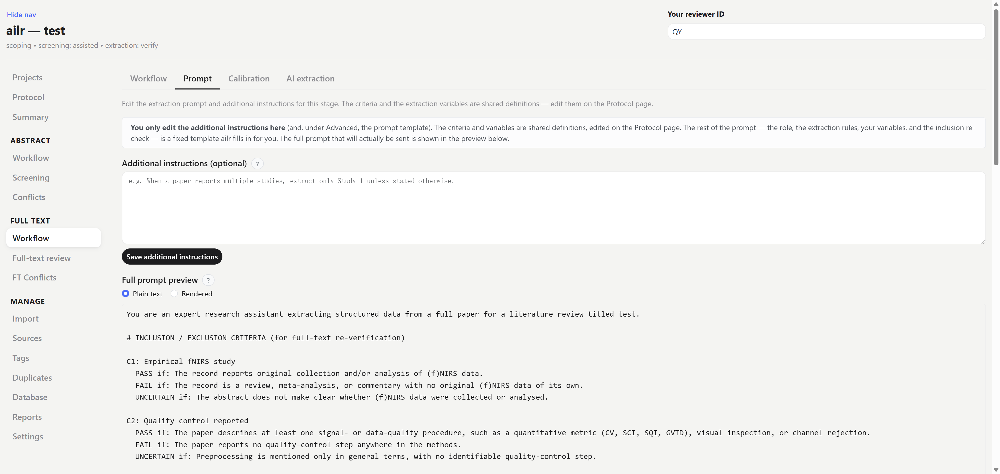
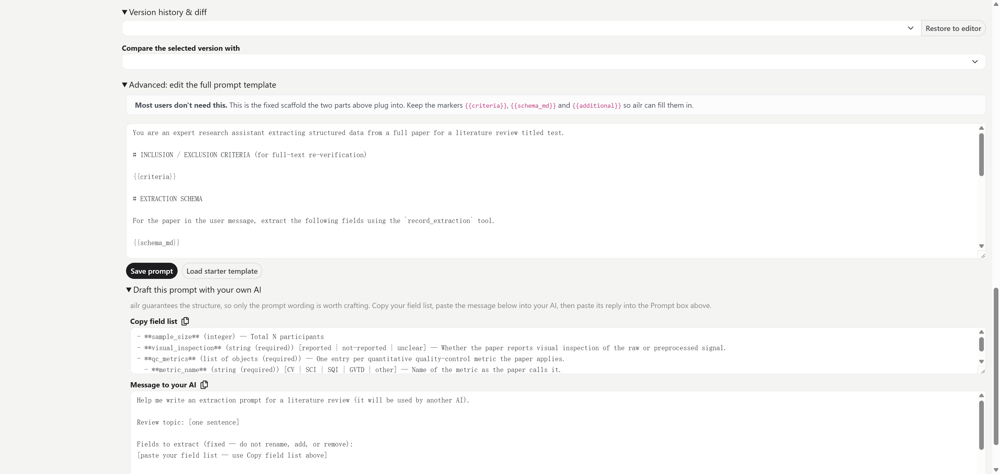
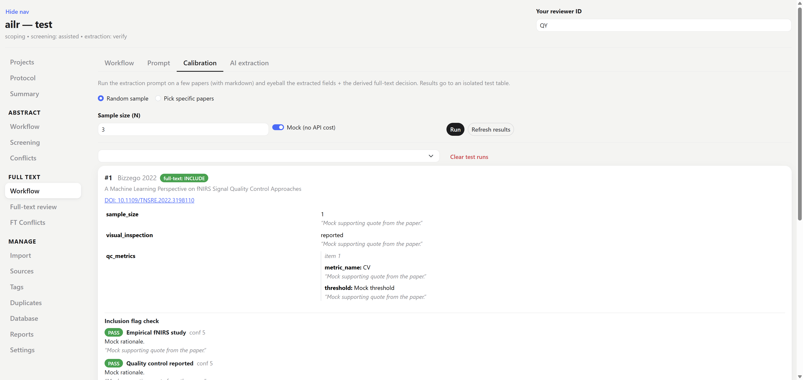
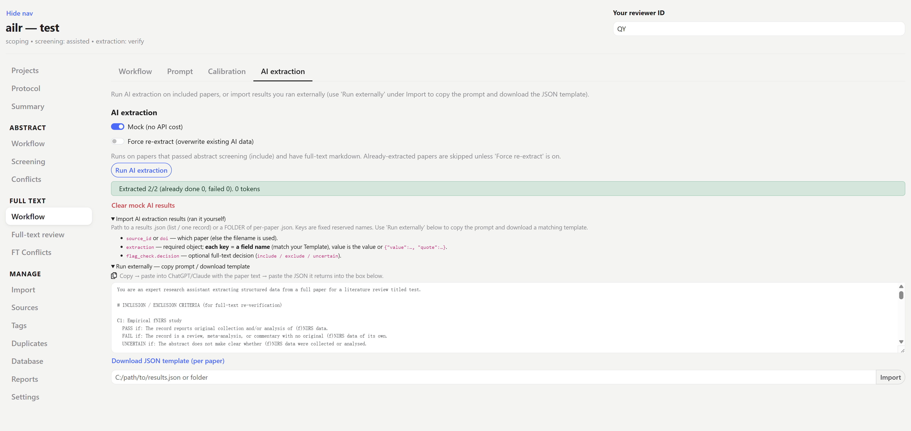
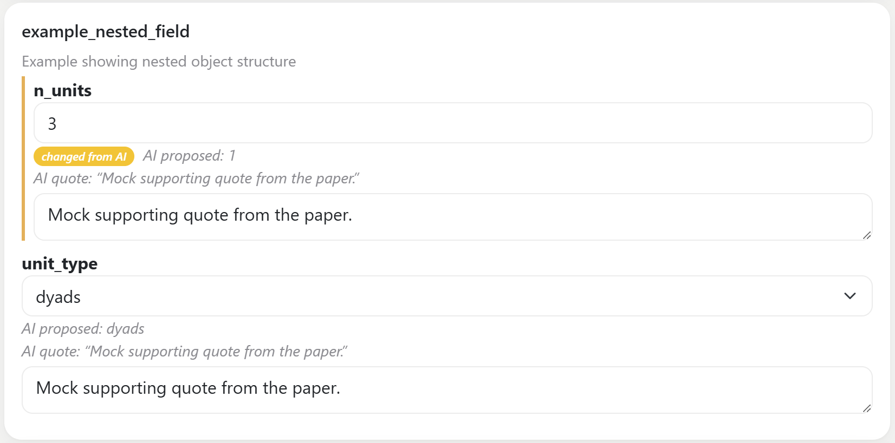

# Data extraction

Pull structured data out of the included full texts. This is the step that turns a pile of papers into a dataset you can analyse. The **variables** (what to extract) and the **extraction workflow** (who does the extracting) are set once on the [Protocol](../protocol.md) page. The rest lives in tabs on the **Full text → Workflow** page, in the order you use them: **Preparation** (PDFs and markdown, covered under [full text](full-text.md)), **Prompt** (how to extract), **Calibration** (test on a few papers), and **AI extraction** (run it last). The **Extraction** sidebar page is the per-paper verify queue.

## 1. Define what to extract, and how

**The variables** (the fields to pull out) are defined on the [**Protocol → Variables**](../protocol.md#variables) page, not here. They are shared definitions: each field carries its type, description, options, whether it's **required**, and whether a **human must verify** it. Set them up before you run extraction (see [Set up your protocol](../protocol.md)).

**The prompt** (how to read the paper) lives on the **Prompt** tab of this Workflow page. Only two parts are worth editing: your **criteria** (shown here, but edited on Protocol) and free-form **additional instructions** (`{{additional}}`, stage-specific guidance). The rest is a fixed scaffold ailr fills in, tucked under *Advanced*, and a live preview shows the full prompt exactly as sent.





### Quality assessment / risk of bias

There is no separate risk-of-bias module, and that is deliberate: an appraisal is a group of extraction variables, so it goes through the same extraction, verification, and consensus flow as everything else. Two common instruments ship as opt-in modules on **Protocol → Variables** — **rob2** (Cochrane RoB 2 for randomized trials: five domains plus an overall judgement, each Low / Some concerns / High) and **newcastle_ottawa** (star counts for cohort and case-control studies). Neither is ticked by default. Tick the one that fits your designs, or copy it as a starting point and edit the domains to match the instrument your protocol specifies.

In `independent` extraction, this means the appraisal is done by two reviewers and reconciled like any other variable, which is what appraisal guidance asks for.

The variables set the *structure* and the prompt sets the *quality*. These are independent, and understanding why is worth a few minutes: see [How AI extraction works](../ai-extraction.md). You can let your own AI draft the [variables](../ai-extraction.md#define-your-variables-with-your-own-ai) or, if you rewrite the scaffold, the [prompt](../ai-extraction.md#rewriting-the-whole-scaffold-advanced), or run the model [entirely outside the app](../ai-extraction.md#run-the-ai-externally-and-import).

:::{tip}
The single highest-leverage thing you can do for extraction quality is a **clear description for each variable** (on Protocol). The model reads those descriptions as the label for where content goes, so a precise field description beats a long prompt. Use an **enum** wherever the answer should be one of a fixed set. List fields honour enums too, so each item is constrained to your options.
:::

## 2. Choose the extraction workflow

Set the workflow on [**Protocol → Workflow**](../protocol.md#workflow), where it sits next to the two screening workflows:

- `verify`: the AI extracts and the **human verifies/edits** each value (the AI value is shown). Fastest path; the human is a checker.
- `independent`: the **human extracts blind** and the AI's values stay hidden until submit. Use when you need a true second independent pass. Two reviewers extract each paper and then reconcile — see [Reconcile two extractions](#reconcile-two-extractions) below.

See [workflow modes](../concepts.md#workflow-modes).

### Calibrate extraction

Like screening, extraction has a **Calibration** tab with the same two modes.

- **Quick test.** Run the AI on a few papers and eyeball the extracted values before extracting the whole set, so you catch a mis-described field while it costs a handful of papers, not all of them. Nothing is written to the review. Choose **Random sample** (N papers) or **Pick specific papers** (a searchable multi-select by author / title / DOI / id) to test on cases you care about.
- **Full calibration.** Measures whether you can trust the AI's **full-text include/exclude verdict**, which it produces while extracting by re-checking each criterion against the full text. A round samples from the full-text queue and runs the real extraction on it, then waits for you: read those papers under **Full-text review → status "Calibration sample"**, decide them yourself, and κ appears against `extraction.target_kappa`. The next round samples papers you have not calibrated on before.

Full calibration needs `extraction.flag_check` on, since the criterion check is where the AI's verdict comes from. Keep N small: unlike screening, each paper is a whole-paper call. The extractions it produces are real and count towards the review, so nothing is wasted. Like screening, it is off under `independent` workflow.



## 3. Run AI extraction

On the **AI extraction** tab, run AI extraction on the included papers, or **import results you ran yourself**. The **Run externally** helper (copy the exact prompt and download the JSON template) sits right next to Import, so generate-and-import live together. **Mock** mode fabricates schema-shaped values so you can test the extraction UI with no API call; a **Force re-extract** toggle re-runs papers that already have extractions (e.g. after you revise the variables). The run makes a couple of AI calls in parallel (2 by default; tune with `extraction.workers` in `lit_review.yaml`; see [per-stage models](../concepts.md#per-stage-models)).

```bash
ailr extract <project-folder>           # included papers
ailr extract <project-folder> --mock    # no API call
ailr extract <project-folder> --force   # re-extract existing
```



## 4. Verify and edit

The **Extraction** page is the verify queue: it shows each paper whose final full-text decision is **include**, with the extracted fields, the verbatim **quote** the AI attached to each value, and the AI's **confidence** (1 to 10) per field (so you can check the value against the source, and skim to the low-confidence fields first). Verify or edit the values per paper.

Where your value differs from the AI's, the field is **highlighted** and shows what the *AI proposed* with a **"changed from AI"** badge, so your edits are easy to spot at a glance, and a reviewer can see exactly where human judgement overrode the model.

While you verify, a **reader pane** beside the form shows the source; toggle it between the original **PDF** and the converted **Markdown**. Use **Save draft** to keep your edits without finalizing (if you leave the page without saving, your edits are not kept), and **Submit** to mark the paper done and return to the list.

:::{note}
After you submit, the form prefills **your saved values**, not the AI's, so re-opening a paper shows what you decided, not what the AI guessed. In `verify` mode a second human submission for the same paper is rejected (one verifier per paper).
:::




## 5. Reconcile two extractions

Only in `independent` mode. Once two reviewers have submitted their own extraction of a paper, it moves to **To reconcile** on the Full-text review list (the filter is not shown in `verify` mode, where one person extracts each paper). Click **Open comparison →**.

The comparison keeps the same split screen as extraction: the paper on the left, the decisions on the right. Variables the two reviewers answered identically are **carried over untouched** and folded away behind a "show the agreed fields" toggle, so the page opens on the handful that actually need a decision. A multi-select answered in a different order counts as agreement, not a difference.

For each disagreement, pick one reviewer's answer — its supporting quote comes along — or type a different final value with your own quote. Repeating groups and nested objects are decided **whole**: both reviewers' versions render as small tables so you can see how they differ, and you choose one. Aligning individual rows across two reviewers would mean guessing which row corresponds to which, and reviewers usually disagree about *how many* entries there are rather than about one cell.

**Save consensus** writes the agreed record and takes the paper out of the queue; **Undo consensus** removes it and puts the paper back. Anyone can adjudicate, including one of the two extractors; whoever does is recorded on the record.

The consensus record is what **Extraction — final** exports. A paper that has not been reconciled yet exports as one row per reviewer (each labelled in the `extractor_id` column) rather than a silently merged row, so unfinished reconciliation is visible in the data.

When extraction is verified, generate your [reports and exports](reports.md).
