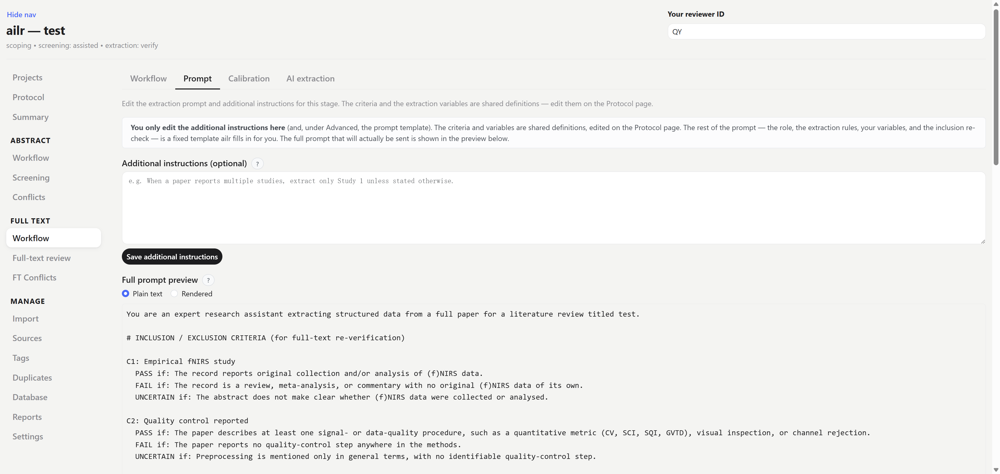
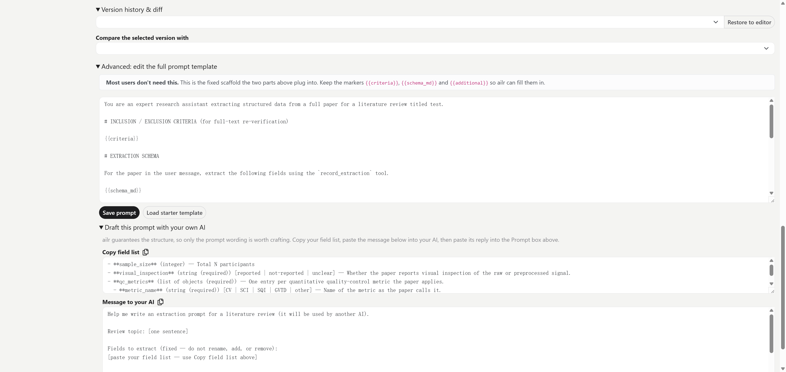
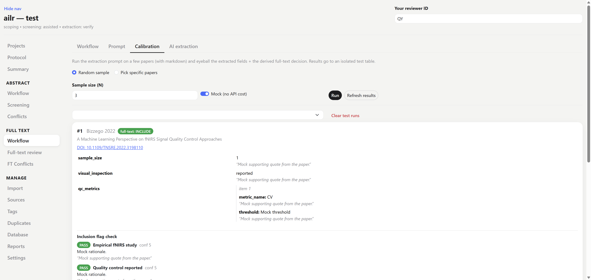
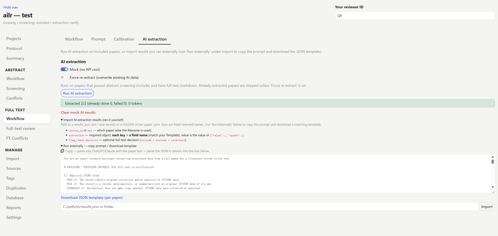
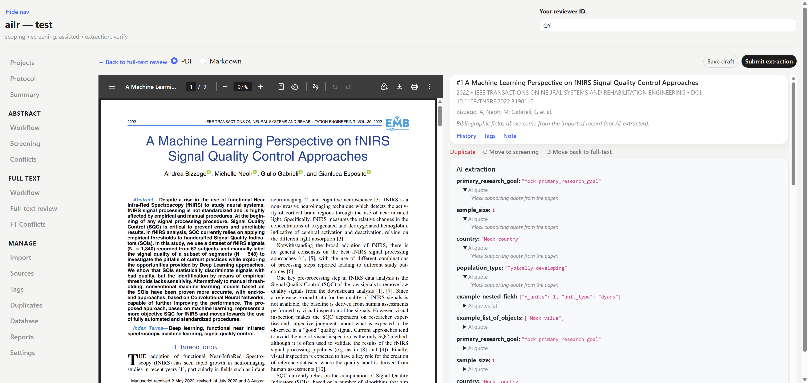
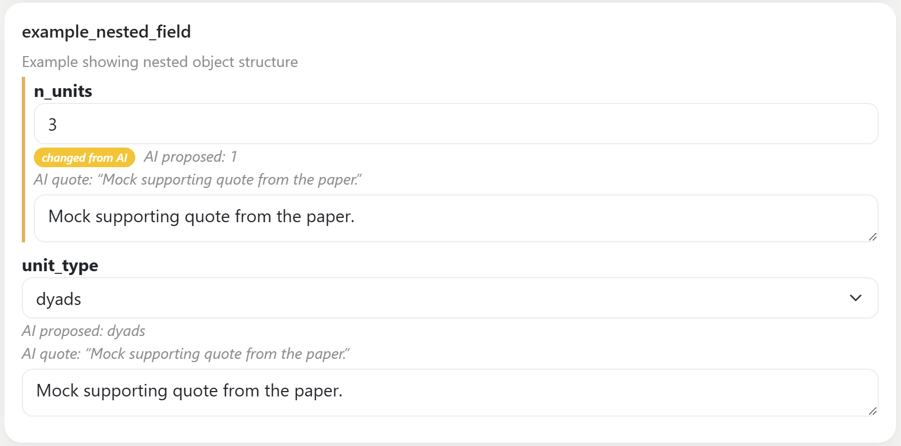

# Data extraction

Pull structured data out of the included full texts. This is the step that turns a pile of papers into a dataset you can analyse. The **variables** (what to extract) and the **extraction workflow** (who does the extracting) are set once on the [Protocol](../protocol.md) page. The rest lives in tabs on the **Full text → Workflow** page, in the order you use them: **Preparation** (PDFs and markdown, covered under [full text](full-text.md)), **Prompt** (how to extract), **Calibration** (test on a few papers), and **AI extraction** (run it last). The **Extraction** sidebar page is the per-paper verify queue.

## 1. Define what to extract, and how

**The variables** (the fields to pull out) are defined on the [**Protocol → Variables**](../protocol.md#variables) page, not here. They are shared definitions: each field carries its type, description, options, whether it's **required**, and whether a **human must verify** it. Set them up before you run extraction (see [Set up your protocol](../protocol.md)).

**The prompt** (how to read the paper) lives on the **Prompt** tab of this Workflow page, which is split into **Extraction** and **Cross-check**. On the Extraction side, only two parts are worth editing: your **criteria** (shown here, but edited on Protocol) and free-form **additional instructions** (`{{additional}}`, stage-specific guidance). The rest is a fixed scaffold ailr fills in, tucked under *Advanced*, and a live preview shows the full prompt exactly as sent. The Cross-check side works the same way and is described under [Cross-check](#cross-check).





### Quality assessment / risk of bias

There is no separate risk-of-bias module, and that is deliberate: an appraisal is a group of extraction variables, so it goes through the same extraction, verification, and consensus flow as everything else. Two common instruments ship as opt-in modules on **Protocol → Variables** — **rob2** (Cochrane RoB 2 for randomized trials: five domains plus an overall judgement, each Low / Some concerns / High) and **newcastle_ottawa** (star counts for cohort and case-control studies). Neither is ticked by default. Tick the one that fits your designs, or copy it as a starting point and edit the domains to match the instrument your protocol specifies.

In `independent` extraction, this means the appraisal is done by two reviewers and reconciled like any other variable, which is what appraisal guidance asks for.

The variables set the *structure* and the prompt sets the *quality*. These are independent, and understanding why is worth a few minutes: see [How AI extraction works](../ai-extraction.md). You can let your own AI draft the [variables](../ai-extraction.md#define-your-variables-with-your-own-ai) or, if you rewrite the scaffold, the [prompt](../ai-extraction.md#rewriting-the-whole-scaffold-advanced), or run the model [entirely outside the app](../ai-extraction.md#run-the-ai-externally-and-import).

:::{tip}
The single highest-leverage thing you can do for extraction quality is a **clear description for each variable** (on Protocol). The model reads those descriptions as the label for where content goes, so a precise field description beats a long prompt. Use an **enum** wherever the answer should be one of a fixed set. List fields honour enums too, so each item is constrained to your options.
:::

## 2. Choose the extraction workflow

Set the workflow on [**Protocol → Workflow**](../protocol.md#workflow), where it sits next to the two screening workflows:

- `verify`: the AI extracts and the **human verifies/edits** each value (the AI value is shown). Fastest path; the human is a checker.
- `independent`: the **human extracts blind** and the AI's values stay hidden until submit. Use when you need a true second independent pass. Two reviewers extract each paper and then reconcile — see [Reconcile two extractions](#reconcile-two-extractions) below.

See [workflow modes](../concepts.md#workflow-modes).

### Calibrate extraction

Like screening, extraction has a **Calibration** tab.

- **Quick test.** Run the AI on a few papers and eyeball the extracted values before extracting the whole set, so you catch a mis-described field while it costs a handful of papers, not all of them. Nothing is written to the review. Choose **Random sample** (N papers) or **Pick specific papers** (a searchable multi-select by author / title / DOI / id) to test on cases you care about. The test composes the *same* prompt the real run sends, additional instructions included, so what you are reading is what you will get. Results carry a **quote audit** (coverage and verbatim rate, with a per-field breakdown and the quotes that were not found in the paper), which is often the fastest way to spot a field the model is answering from memory rather than from the text.
To judge those same papers yourself, go to **Full-text review → status "Last quick test"**: it lists exactly the papers the most recent quick test covered. The AI's full-text verdict stays hidden on each card until you submit your own, so the comparison is a fair one. Keep N small: unlike screening, each paper is a whole-paper call.

- **Cross-check this run.** Beside the run picker, this rehearses the [cross-check](#cross-check) on the run you are looking at — same checker, same prompt, smaller sample. The result is a table of *which fields* got flagged and how often. That breakdown is the point: "this field is flagged in 8 of 10 papers" tells you the field's description needs work, whereas one overall percentage tells you nothing you can act on. Findings from a quick test are stored against that run and never appear in the real extraction badges or counts.



## 3. Run AI extraction

On the **AI extraction** tab, run AI extraction on the included papers, or **import results you ran yourself**. The **Run externally** helper (copy the exact prompt and download the JSON template) sits right next to Import, so generate-and-import live together. **Mock** mode fabricates schema-shaped values so you can test the extraction UI with no API call; a **Force re-extract** toggle re-runs papers that already have extractions (e.g. after you revise the variables). The run makes a couple of AI calls in parallel (2 by default; tune with `extraction.workers` in `lit_review.yaml`; see [per-stage models](../concepts.md#per-stage-models)).

```bash
ailr extract <project-folder>           # included papers
ailr extract <project-folder> --mock    # no API call
ailr extract <project-folder> --force   # re-extract existing
```

The run summary reports what happened rather than just a count: the **quote audit** rates for the run (how many values came back with a quote, and how many of those quotes are in the paper word for word), and for any paper that failed, the recorded error and its type, so you can tell a truncated response from a schema mismatch without opening the log.



## 4. Cross-check

:::{warning}
Not yet tested in production.
:::

This step is optional; skip it and everything else works as before. A cross-check **audits a record that already exists**. It is given the recorded value and the quote offered as its support, and asked whether the paper actually backs that up. It never extracts anything of its own, and it is not a third reviewer: because its input contains the record it is judging, it is not independent of it, so its verdicts stay out of agreement statistics, conflict resolution, and the PRISMA counts. Nothing it produces blocks a submission.

There are two layers, and they are stored and shown side by side.

**Deterministic** (no API calls, free to run). Pure string and schema comparisons, so the verdict is reproducible:

- `quote_not_found` — the attached quote does not appear in the paper's markdown. Matching folds the differences PDF conversion introduces (ligatures, curly quotes, words hyphenated across a line break) and handles quotes the model elided with `...`.
- `value_not_in_quote` — a numeric value that appears nowhere in its own supporting quote, which is the signature of a number carried over from elsewhere in the paper.
- `invalid_enum` — the value is not one of the options the variable declares.
- `empty_required` — a required variable came back empty, or was never extracted.

**LLM** (one call per paper, off by default). A second model reads the paper, the schema, and each value with its quote, and returns **agree / disagree / uncertain** per field with a one-sentence reason and, where the paper states a specific different value, a **suggested value**.

:::{important}
The checker must be a **different model** from the one that extracted. A model agrees with itself far more often than an independent one does, so a same-model check produces a number that cannot be reported. ailr refuses to run it and tells you why; `crosscheck.allow_same_model` overrides this if you are deliberately running that comparison.
:::

The checker is deliberately **not** shown the extractor's confidence or reasoning. Seeing how sure the first model was anchors the second onto the answer it is supposed to be testing.

### Running it

Both layers run from the **AI extraction** tab, over the whole project. A single paper can also be cross-checked from its action row in the verify queue. **Mock** mode runs the LLM layer with fabricated verdicts so you can see the whole flow before spending anything.

Under **Settings → Cross-check** you choose whose extractions get read (`targets`: the AI, the humans, or both), the checker's provider and model, and whether the LLM layer is enabled at all. Each extractor's findings are stored separately, so checking one reviewer's rows never clears another's.

### Reading the findings

Findings appear as badges beside each field in the AI panel of the verify form, with a line at the top of the panel naming the flagged fields. A field that was checked and came back clean says `checked`, so "no problem found" is distinguishable from "never checked". Expanding a badge shows the reason and, for the LLM layer, any suggested value with a **Use this value** button that drops it into your form (scalar fields only — a suggestion is a plain string, so list and object fields show it but leave the edit to you). As with the other fill buttons, nothing is written until you Save or Submit.

Two more places surface them: the full-text queue has a **Cross-check flagged** status filter, and the dashboard's extraction card counts the flagged papers.

A finding goes **stale** when the row it judged is re-extracted, since it now describes a value that no longer exists. Stale findings are hidden from the badges and excluded from both the filter and the dashboard count, so the three never disagree about what is outstanding.

### What the numbers mean

:::{caution}
`quote_not_found` has a real false-positive rate: PDF-to-markdown conversion mangles passages, so a genuine quote can fail to match. Check the paper before changing a value on this flag alone.

The LLM layer's agreement rate is **not** an accuracy measure — the checker sees the value it is judging, so it leans towards agreeing. Use it to compare prompt versions, not to report accuracy.
:::

### Its prompt

The cross-check prompt is on the **Prompt → Cross-check** tab, beside the extraction prompt it judges. ailr ships a default, so you only need to touch it if your variables need domain-specific guidance — for example, that N in your literature means dyads rather than individual participants, which belongs in **additional instructions**. Under *Advanced* you can edit the whole scaffold; keep the `{{project_name}}`, `{{schema_md}}` and `{{additional}}` markers so ailr can fill them in. Saving writes `prompts/crosscheck.txt` into your project; delete that file to fall back to the built-in prompt, or use **Restore built-in prompt**.

## 5. Verify and edit

The **Extraction** page is the verify queue: it shows each paper whose final full-text decision is **include**, with the extracted fields, the verbatim **quote** the AI attached to each value, and the AI's **confidence** (1 to 10) per field (so you can check the value against the source, and skim to the low-confidence fields first). Verify or edit the values per paper. The AI panel also carries the **flag_check** block, the model's PASS / FAIL / UNCERTAIN verdict per criterion, each with the quote it read that verdict off.

Where your value differs from the AI's, the field is **highlighted** and shows what the *AI proposed* with a **"changed from AI"** badge, so your edits are easy to spot at a glance, and a reviewer can see exactly where human judgement overrode the model. The badge tracks what you type, so a field is marked the moment it diverges.

While you verify, a **reader pane** beside the form shows the source; toggle it between the original **PDF** and the converted **Markdown**. Use **Save draft** to keep your edits without finalizing (if you leave the page without saving, your edits are not kept), and **Submit** to mark the paper done and return to the list.

For a **repeating group**, the field is a small table: rows can be added *and* removed (select a row, then delete it), and rows left entirely blank are dropped when you save, so a mis-added row does not become an empty object in the data.

:::{note}
After you submit, the form prefills **your saved values**, not the AI's, so re-opening a paper shows what you decided, not what the AI guessed. In `verify` mode a second human submission for the same paper is rejected (one verifier per paper).
:::

### Take the AI's value back

Because the form pins to what you saved, an edit you later think better of used to be yours to retype. Two controls put the AI's answer back:

- **Use**, beside each field, drops the AI's value for that one field into the widget (**Use AI rows** for a repeating group, which replaces the table).
- **Fill all fields from AI**, at the foot of the form, does the whole form at once, behind a confirmation. The picker next to it chooses *which* run to draw from: the current one, or any earlier run a re-run retired.

Neither writes anything: the values land in the form and are yours to adjust, and nothing is stored until **Save draft** or **Submit**. Fields the chosen run left empty are left alone rather than blanked. Both appear only under `verify`, since `independent` extraction hides the AI's values until you submit.

### Re-run the AI on one paper

**↻ Re-run AI extraction**, in the paper's action row, runs the current prompt and schema against this paper again. Use it after you revise the variables or the prompt and want to see what changes on a paper you already know, without a project-wide `--force`.

The run it replaces is not discarded: it is kept as an **earlier version**, listed under the AI extraction panel and available in the fill-all picker. Your saved values are untouched, but the form reloads when the run finishes, so save any unsaved edits first.

### Who holds a paper

Saving a draft **claims** a paper: under `verify` only one reviewer extracts each paper, and a draft counts as a claim just as a submission does. So:

- The **To extract** queue hides papers another reviewer already holds, and the [full-text list](full-text.md#2-full-text-review) marks them **In progress by \<reviewer\>** instead of "To extract".
- Open a paper someone else holds and the page says **who** claimed it, rather than only refusing to edit.
- **Release this paper** appears while *you* hold an unsubmitted claim. It discards your draft and hands the paper back to the queue. Once you submit, the extraction is final and the release option is gone.





## 6. Reconcile two extractions

Only in `independent` mode. Once two reviewers have submitted their own extraction of a paper, it moves to **To reconcile** on the Full-text review list (the filter is not shown in `verify` mode, where one person extracts each paper). Click **Open comparison →**.

The comparison keeps the same split screen as extraction: the paper on the left, the decisions on the right. Variables the two reviewers answered identically are **carried over untouched** and folded away behind a "show the agreed fields" toggle, so the page opens on the handful that actually need a decision. A multi-select answered in a different order counts as agreement, not a difference.

For each disagreement, pick one reviewer's answer — its supporting quote comes along — or type a different final value with your own quote. Repeating groups and nested objects are decided **whole**: both reviewers' versions render as small tables so you can see how they differ, and you choose one. Aligning individual rows across two reviewers would mean guessing which row corresponds to which, and reviewers usually disagree about *how many* entries there are rather than about one cell.

**Save consensus** writes the agreed record and takes the paper out of the queue; **Undo consensus** removes it and puts the paper back. Anyone can adjudicate, including one of the two extractors; whoever does is recorded on the record.

The consensus record is what **Extraction — final** exports. A paper that has not been reconciled yet exports as one row per reviewer (each labelled in the `extractor_id` column) rather than a silently merged row, so unfinished reconciliation is visible in the data.

When extraction is verified, generate your [reports and exports](reports.md).
