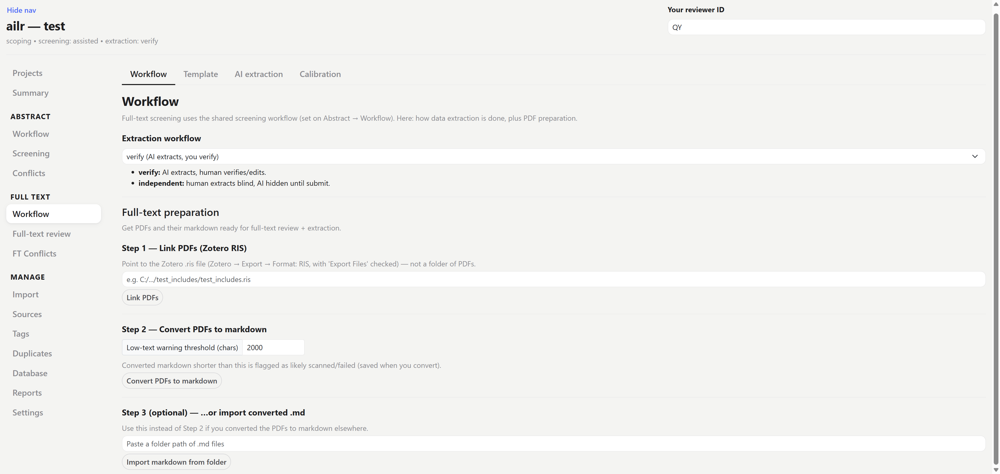
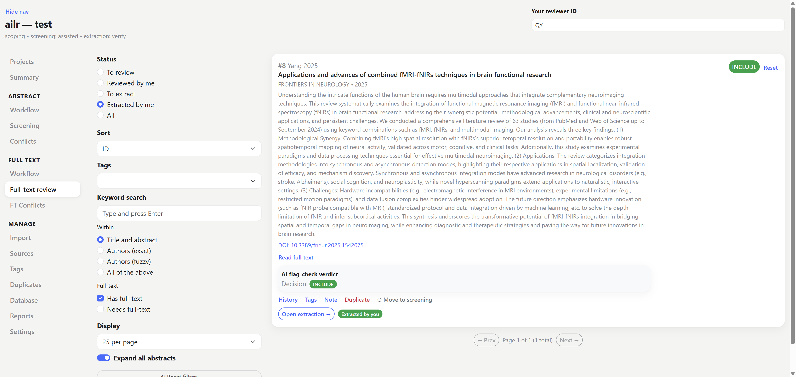
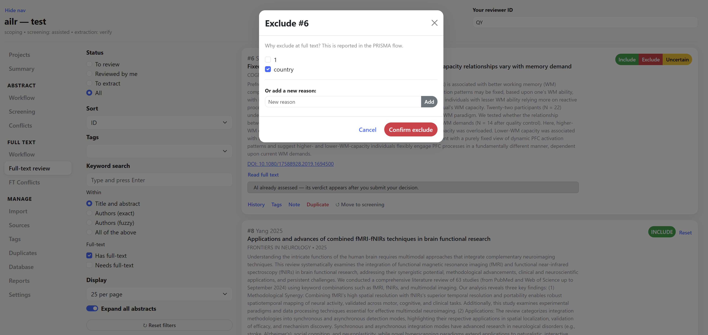
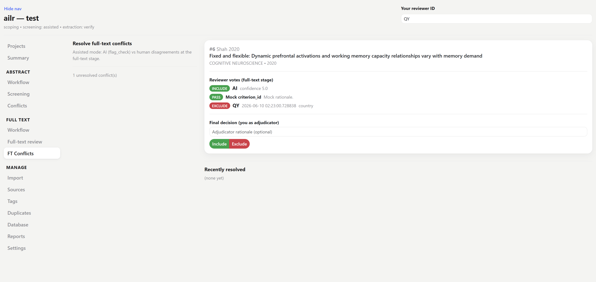

# Full text & screening

Acquire the full text of the papers that passed abstract screening, then read and include/exclude them against the full paper rather than just the abstract. Sidebar (under **Full text & extraction**): **Workflow**, **Full-text review**, **FT Conflicts**.

## 1. Link PDFs and convert to markdown

Before you can review full text, each included paper needs a PDF and a markdown version of it. Both are set up on the **Workflow** page (full text).

### Link PDFs from Zotero

ailr does not download PDFs — you gather them in Zotero, then hand ailr a Zotero export that records where each PDF is. The round trip:

1. **Export the included set as RIS.** On the **Reports** page, export the papers that passed abstract screening as **RIS**.
2. **Import that RIS into Zotero.** Zotero now holds exactly the included references.
3. **Get the full-text PDFs in Zotero** — use Zotero's *Find Full Text*, or attach them manually, so each reference has its PDF.
4. **Export from Zotero, with files.** Select the collection → right-click → **Export**, choose format **RIS** and tick **Export Files**. Zotero writes a folder containing the `.ris` file plus subfolders holding the PDFs, and each record's `L1` line stores a **relative path** to its PDF.

:::::{grid} 2
::::{grid-item}
:::{image} ../figures/zotero1.png
:alt: Zotero export dialog — RIS format with Export Files ticked
:::
::::
::::{grid-item}
:::{image} ../figures/zotero2.png
:alt: the exported folder — the RIS alongside PDF subfolders
:::
::::
:::::

5. **Point ailr at that RIS:**

   ```bash
   ailr import-pdfs <project-folder> path/to/zotero-export.ris
   ```

   ailr matches each PDF to its source **by DOI** and links it — the files are **referenced in place, not copied**, so your Zotero export stays the single source of truth and the project folder stays small.

:::{tip}
Because the RIS stores **relative** paths to the PDFs, you can drop the whole exported folder (the `.ris` plus its PDF subfolders) into your shared / synced project location and the links still resolve for the team. Each teammate whose absolute path to that folder differs just sets **their own** PDF folder in **Settings** — see [Sharing PDFs](../team.md#sharing-pdfs).
:::

### Convert PDF → markdown

Linked PDFs are converted to markdown so the AI (and you) can read the full text. The default backend is `pymupdf`; references are stripped by default to keep the text focused on the study itself.

```bash
ailr preprocess <project-folder>
ailr preprocess <project-folder> --list-missing   # see which sources have no PDF
```

:::{tip}
Conversion **flags scanned / low-text PDFs**. The check is a simple character count: if the converted markdown is shorter than the **low-text threshold** (default 2000 characters), the source is reported as a likely scanned or failed extraction — a real full paper runs many thousands of characters, so a tiny result usually means the PDF was page images, not selectable text. Adjust the number in the **Low-text warning threshold (chars)** box on the Workflow page — raise it to be stricter, lower it to silence false alarms — and it is saved when you convert. Re-acquire a text PDF (or OCR it) for flagged sources before relying on them, otherwise the AI is reading an almost-empty document.
:::



## 2. Full-text review

The **Full-text review** page lists each candidate — a paper marked *include* at abstract **and** with markdown available — with **include / exclude** controls. When you exclude a paper, **record the reason**; exclusion reasons are required for the PRISMA flow diagram, and recording them here means you never have to reconstruct them later.

Handy controls on this page:

- **Expand all abstracts** — read the abstract inline without leaving the list, to re-orient before opening the full text.
- Status filters including **To extract**, and a per-paper button to **jump straight into extraction** once a paper is included — so you can read and extract a paper in one pass without hunting for it again.





:::{note}
AI extraction runs on the **abstract-screening includes**, and its `flag_check` verdict (an AI re-check of the inclusion criteria against the full text) is available here as a reference for your full-text decision. The **human** full-text decision is what actually advances a paper to extraction.
:::

## 3. Reconcile conflicts

Disagreements at full text surface on the **FT Conflicts** page — reconcile them the same way as abstract conflicts, recording exclusion reasons where relevant so the PRISMA "excluded at full text, with reasons" count stays complete.



Papers whose **final full-text decision is include** appear in the [extraction](extraction.md) queue.
