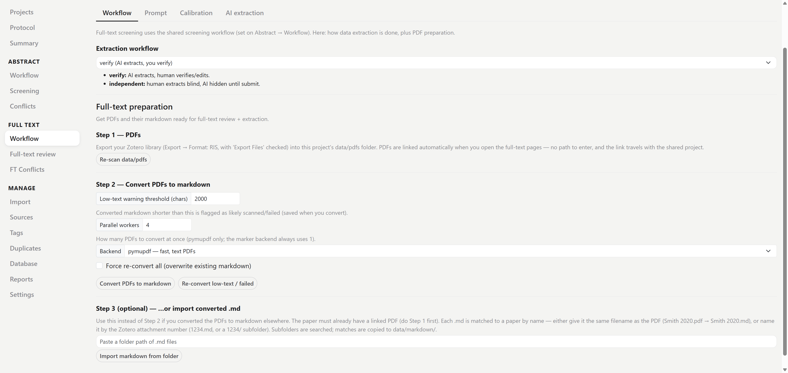
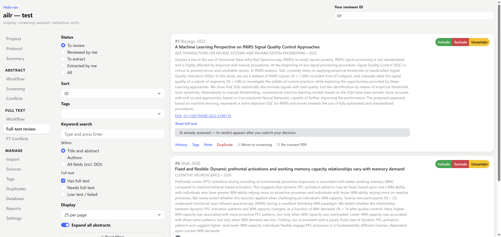
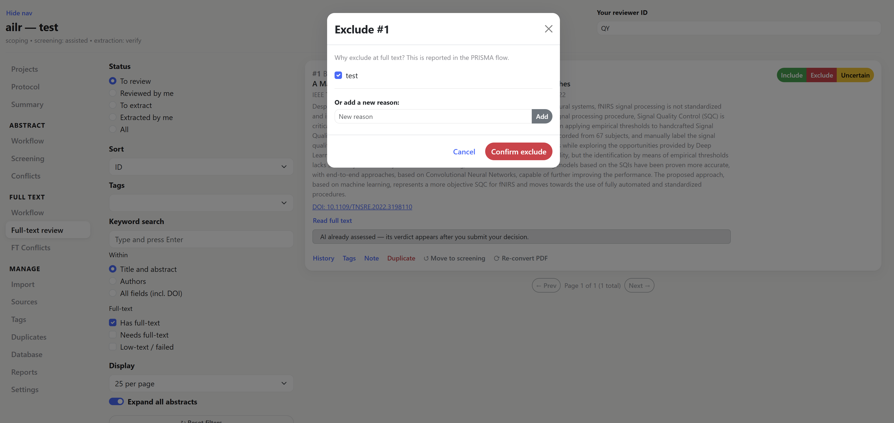
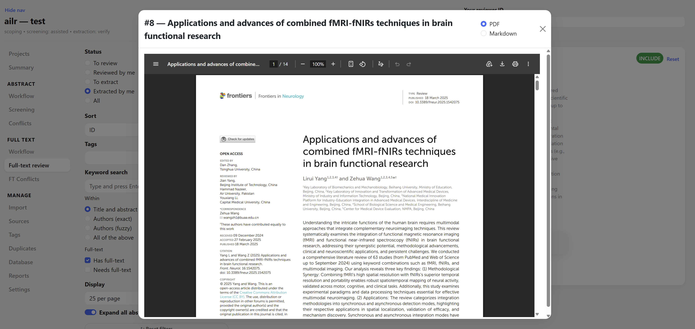

# Full text & screening

Acquire the full text of the papers that passed abstract screening, then read and include/exclude them against the full paper rather than just the abstract. Sidebar (under **Full text & extraction**): **Workflow**, **Full-text review**, **FT Conflicts**.

## 1. Link PDFs and convert to markdown

Before you can review full text, each included paper needs a PDF and a markdown version of it. Both are set up on the **Preparation** tab of the **Workflow** page (full text). Who screens and who extracts is not here: all three stage workflows are set on [**Protocol → Workflow**](../protocol.md#workflow).

### Link PDFs from Zotero

ailr does not download PDFs. You gather them in Zotero, then **drop the export into the project's `data/pdfs/` folder**, where ailr links them automatically. The round trip:

1. **Export the included set as RIS.** On the **Reports** page, export the papers that passed abstract screening as **RIS**.
2. **Import that RIS into Zotero.** Zotero now holds exactly the included references.
3. **Get the full-text PDFs in Zotero.** Use Zotero's *Find Full Text*, or attach them manually, so each reference has its PDF.
4. **Export from Zotero into `data/pdfs/`, with files.** Select the collection → right-click → **Export**, choose format **RIS**, tick **Export Files**, and save it **inside the project's `data/pdfs/` folder**. Zotero writes the `.ris` plus subfolders of PDFs there.

:::::{grid} 2
::::{grid-item}
:::{image} ../figures/zotero1.png
:alt: Zotero export dialog, RIS format with Export Files ticked
:::
::::
::::{grid-item}
:::{image} ../figures/zotero2.png
:alt: the exported folder, the RIS alongside PDF subfolders
:::
::::
:::::

5. **Open the full-text pages.** ailr scans `data/pdfs/`, matches each PDF to its source **by DOI**, and links it **automatically**; there is no path to enter. (Added more later? Click **Re-scan data/pdfs** on the Preparation tab.) Files are **referenced in place, not copied**, and each link is stored **relative to the project root**.

:::{tip}
Because links are stored relative to the project root, they **resolve on every teammate's machine** as soon as the project folder is on the shared drive; there is nothing per-person to set up. See [Sharing PDFs](../team.md#sharing-pdfs).
:::

:::{note}
Prefer the command line? `ailr import-pdfs <project-folder> <zotero.ris>` does the same linking from a RIS file anywhere on disk.
:::

### Convert PDF → markdown

Linked PDFs are converted to markdown so the AI (and you) can read the full text. The default backend is `pymupdf` (a **backend selector** on the Preparation tab lets you switch to `marker`); references are stripped by default to keep the text focused on the study itself. Conversion runs several PDFs **in parallel** (a *Parallel workers* setting, default 4).

The Preparation tab gives you re-conversion controls when a PDF comes in badly:

- **Re-convert PDF** on a single paper, **Force re-convert all**, or **Re-convert low-text / failed** to redo just the ones that came out empty or too short (e.g. after swapping a scanned PDF for a text one, or changing the backend).
- A **Low-text / failed** filter surfaces exactly those papers.

```bash
ailr preprocess <project-folder>
ailr preprocess <project-folder> --list-missing   # see which sources have no PDF
```

:::{tip}
Conversion **flags scanned / low-text PDFs**. The check is a simple character count: if the converted markdown is shorter than the **low-text threshold** (default 2000 characters), the source is reported as a likely scanned or failed extraction. A real full paper runs many thousands of characters, so a tiny result usually means the PDF was page images, not selectable text. Adjust the number in the **Low-text warning threshold (chars)** box on the Preparation tab (raise it to be stricter, lower it to silence false alarms); it is saved when you convert. Re-acquire a text PDF (or OCR it) for flagged sources before relying on them, otherwise the AI is reading an almost-empty document.
:::



## 2. Full-text review

Full-text screening has **its own workflow**, set on [**Protocol → Workflow**](../protocol.md#workflow) and independent of the abstract stage. The usual design is `assisted` at title/abstract and `independent` (two humans) at full text. Under `assisted` the AI's verdict here comes from AI extraction's per-criterion `flag_check`, so extraction has to have run for the AI to have a vote.

The **Full-text review** page lists each candidate with **include / exclude** controls. A paper becomes a candidate once abstract screening is **settled on include** for it and its markdown is available; one still waiting on a second reviewer, or in an unresolved abstract conflict, stays at the abstract stage. When you exclude a paper, **record the reason**; exclusion reasons are required for the PRISMA flow diagram, and recording them here means you never have to reconstruct them later.

Handy controls on this page:

- **Expand all abstracts.** Read the abstract inline without leaving the list, to re-orient before opening the full text.
- Status filters including **To extract** (papers not yet extracted) and **Extracted by me**, and a per-paper button to **jump straight into extraction** once a paper is included, so you can read and extract a paper in one pass.
- **Sort by AI confidence (lowest first)** to surface uncertain papers, and an **AI outdated** badge flags papers extracted under criteria or a prompt that have since changed.
- A **Read full text** button opens the PDF or markdown in a reader without leaving the page (also on the FT Conflicts cards).
- **Mark full text as not retrieved**, on papers with no markdown, for a full text you tried to obtain and could not. This is what fills PRISMA's *reports not retrieved* box. A paper you simply have not fetched yet is not the same thing, so leave it unmarked until you have given up on it.
- **Same study as…**, for a paper that reports the same study as another included paper (a main paper and its protocol or secondary analysis). PRISMA counts those as one study across several reports; see [Reports](reports.md).







:::{note}
AI extraction runs on the **settled abstract-screening includes**, and its `flag_check` verdict (an AI re-check of the inclusion criteria against the full text) is a reference for your decision here, and the AI's vote when this stage is `assisted`. The **settled** full-text decision is what advances a paper to extraction.
:::

## 3. Reconcile conflicts

Disagreements at full text surface on the **FT Conflicts** page. Reconcile them the same way as abstract conflicts, recording exclusion reasons where relevant so the PRISMA "excluded at full text, with reasons" count stays complete.


Papers whose **final full-text decision is include** appear in the [extraction](extraction.md) queue.
