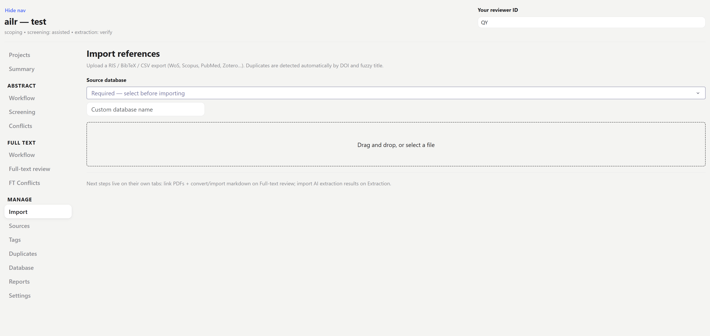
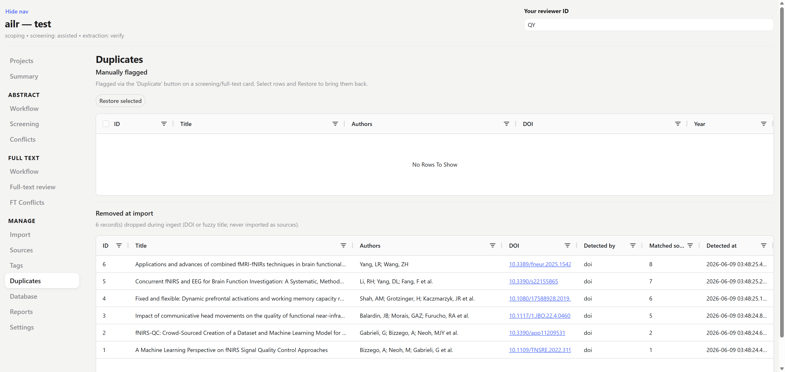
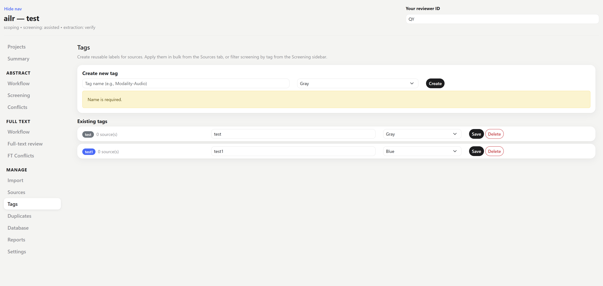
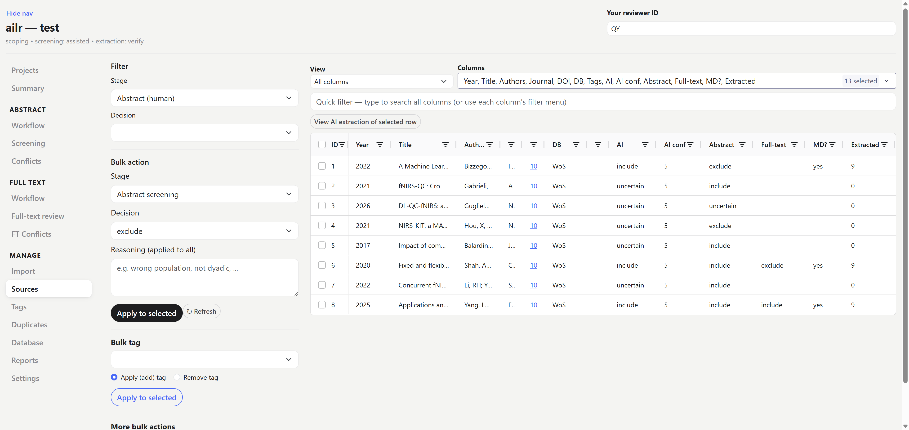

# Import & deduplicate

The first stage: bring your database search results in and flag duplicates, so that everything downstream works from one clean set of records. Sidebar: **Import**, with **Sources**, **Tags**, and **Duplicates** for managing the records afterwards.

## Import references

On the **Import** page, drop a **RIS / BibTeX / CSV** export of your search results — one file per database export is fine, and you can import several in turn (a paper found in two databases is caught at the deduplicate step). Pick the file's **source database** — a required selector with the common databases (WoS, PubMed, Scopus…), a custom field for anything else, and *Auto-detect* — so each record remembers where it came from; this is what lets the PRISMA flow report "records identified per database".



Each imported record becomes a **source** with its bibliographic metadata (title, abstract, authors, year, journal, DOI/PMID).

:::{note}
This bibliographic metadata is **never re-extracted by the AI** — it is the trusted record, and is joined back into every export by `source_id`. The AI only ever adds what the *full text* contains, so your citations stay authoritative.
:::

CLI equivalent:

```bash
ailr ingest <project-folder> results.ris --source-db PubMed
```

## Record your search strategy

For a reproducible review, PRISMA expects you to report *what you searched and how*. On the **Import** page you can **archive each database's search** — the query string, the date, any limits (years, language…), and the number of records it returned. Recorded searches are listed on the page under **Recorded searches**, and are emitted in the **methods export**, so the search appendix writes itself instead of being reconstructed from memory.

This is optional but worth doing at import, while the details are fresh.

## Deduplicate

Duplicates are flagged **automatically** on import, by two rules:

- exact match on **DOI**
- fuzzy match on **title** (catches the same paper with slightly different punctuation or casing across databases)

Review them on the **Duplicates** page — each flagged pair is shown side by side so you can **confirm** it is the same paper or **clear** a false match. Confirmed duplicates are marked so they drop out of the screening queue and are counted on the PRISMA flow diagram (so your "duplicates removed" number is auditable, not a manual guess).



## Manage records

| Page | Use it to |
|------|-----------|
| **Sources** | the master spreadsheet — filter, bulk-edit, tag, and inspect every record (see below) |
| **Tags** | create labels (e.g. by sub-question or source) to apply on Sources |
| **Duplicates** | review and resolve the auto-flagged duplicate pairs |

### Tags

Create tags on the **Tags** page — for example one per sub-question, per reviewer's batch, or to mark records that need a second look. Tags are then applied in bulk from the Sources page and can be used as a filter anywhere a record list appears, so they are a lightweight way to slice a large library without changing any screening decision.



### The Sources page

**Sources** is the workhorse table (an ag-grid spreadsheet) you will come back to throughout the review, not just at import. From here you can:

- **Choose which columns to show** — presets (*Screening*, *Full-text & extraction*, *Bibliographic*, *All*) or a custom column picker, plus a **quick filter** box that searches every column.
- **Filter** by stage (abstract-human / full-text-human / AI) and by decision (include / exclude / uncertain / not yet decided) — e.g. to find everything the AI marked *uncertain* but no human has touched.
- **Bulk-set a decision** on the selected rows — choose the **stage** (abstract or full-text), the decision (include / exclude / uncertain), and an optional reasoning. Useful for clearing an obvious batch without clicking through cards one by one.
- **Bulk-tag** — add or remove a tag on the selected rows.
- **More bulk actions** — *Mark as duplicate*, *Move to abstract screening*, or *Move back to full-text* for the selected rows.
- **View an extraction** — open any source to see its AI-extracted fields (value + quote + confidence) and its flag-check verdicts, without leaving the table.



:::{tip}
Bulk-setting decisions here writes the same audited rows as the card UI — it does not bypass the trail. Use it to speed up the clear-cut cases, and the **Screening** cards for the judgement calls.
:::

When references are in and duplicates resolved, move on to [abstract screening](abstract-screening.md).
