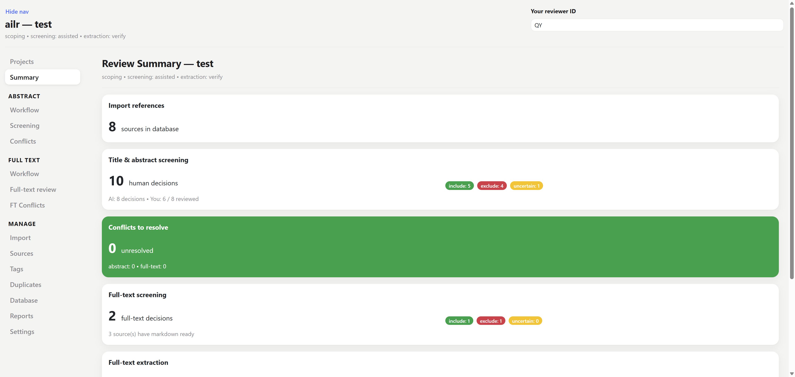
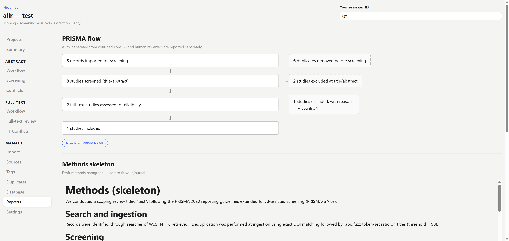
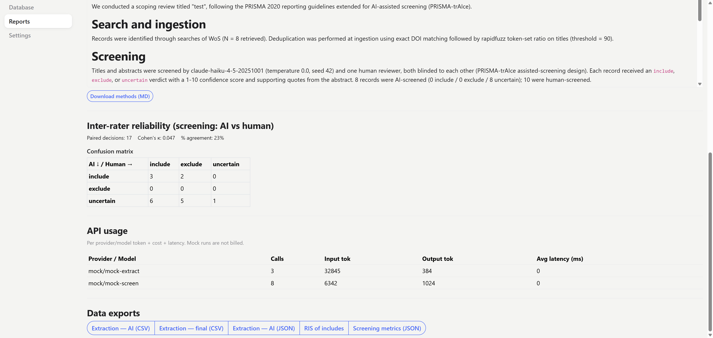
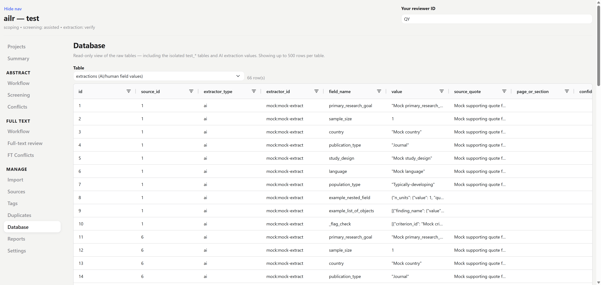

# Reports & exports

The final stage: the auditable outputs of the review. Because every decision and extraction was stored with its reviewer, timestamp, and prompt version, these reports are **derived from the data**, not assembled by hand — so they stay correct as you keep working. Sidebar: **Reports** (plus **Summary** for an at-a-glance dashboard, and **Database** to browse the raw tables).

## Summary

The **Summary** page is the dashboard you land on — counts at each stage (imported, screened, included, extracted), so you can see at a glance how far the review has progressed and where the queue is backed up.



## Reports

The **Reports** page assembles everything a methods section and a reproducibility appendix need:

| Report | What it gives you |
|--------|-------------------|
| **PRISMA flow** | records identified → deduplicated → screened → excluded (with reasons) → included; the identification box breaks down **records per source database**, and the diagram **exports as SVG** (vector) for your manuscript |
| **Methods skeleton** | a prose outline of how the review was run (workflow, models, criteria), including the **search strategies** you recorded at import |
| **Inter-rater reliability** | Cohen's κ plus a **confusion matrix** of AI vs. human (or human vs. human) |
| **API usage** | token counts and calls per stage, for cost reporting |

Every number here traces back to stored rows: the PRISMA counts come from the actual decisions and recorded exclusion reasons, and κ from the paired AI/human verdicts — so the figures you report are the figures the app can defend.





## Exports

Export the dataset in the format your analysis needs:

| Format | Use |
|--------|-----|
| **CSV** | the extraction table for stats software |
| **JSON** | structured records (values + evidence quotes) |
| **RIS** | the included set back into a reference manager |
| **PRISMA SVG** | the flow diagram as a vector image, ready for a manuscript figure |

CLI equivalent:

```bash
ailr export <project-folder> --format csv          # also: json · ris · prisma-svg
```

Bibliographic metadata is joined into every export by `source_id`, so each row carries both the trusted citation and the AI-extracted full-text data — one table, ready to analyse, with the source quote available for any value you need to defend.

## Browse the raw data

The **Database** page lets you browse the underlying tables directly — useful for spot-checking a decision or extraction, or for understanding how a number on a report was derived. It is read-oriented: a window onto the same append-only tables the reports are built from. See [Internals](../internals.md) for the table layout.


