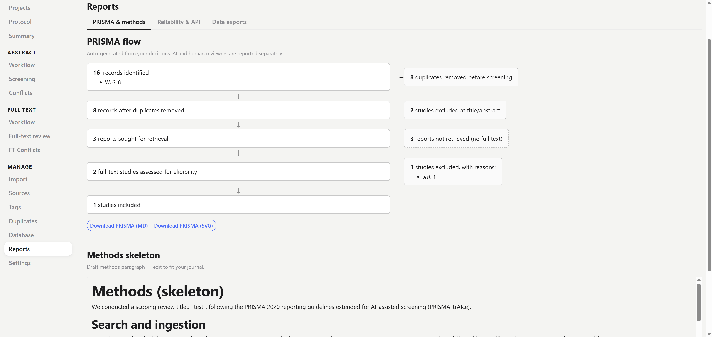
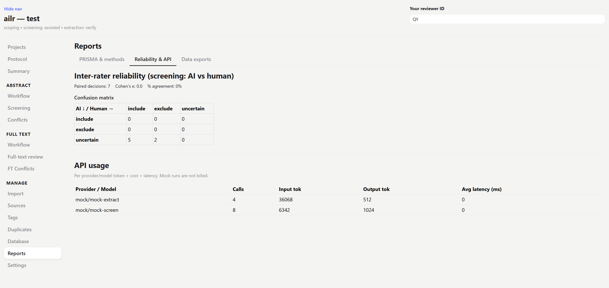
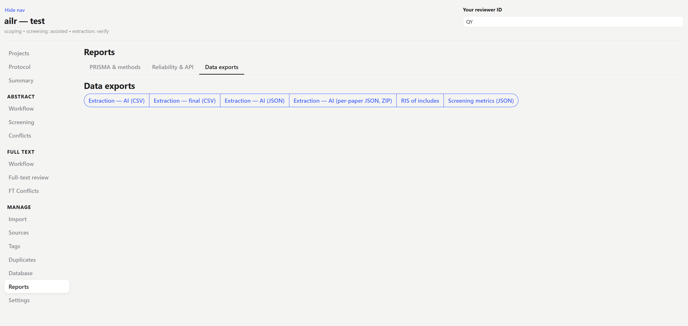
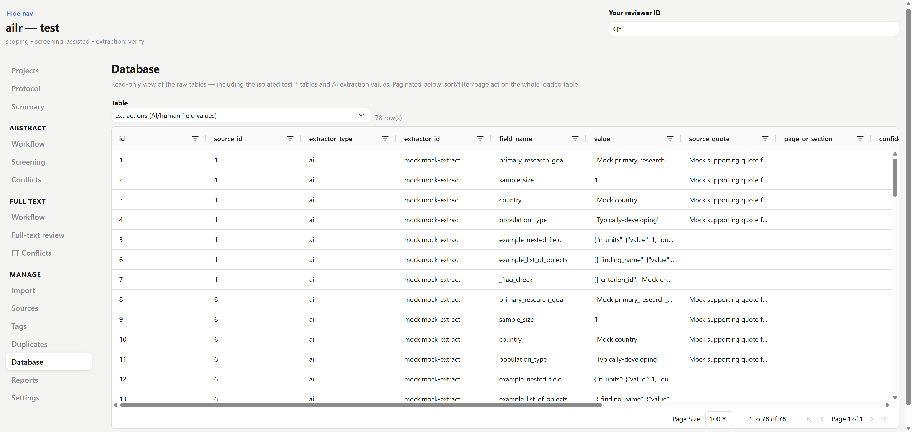

# Reports & exports

The final stage: the auditable outputs of the review. Because every decision and extraction was stored with its reviewer, timestamp, and prompt version, these reports are **derived from the data**, not assembled by hand, so they stay correct as you keep working. Sidebar: **Reports** (plus **Summary** for an at-a-glance dashboard, and **Database** to browse the raw tables).

## Summary

The **Summary** page is the dashboard you land on. It shows counts at each stage (imported, screened, included, extracted), so you can see at a glance how far the review has progressed and where the queue is backed up.


## Reports

The **Reports** page (split into **PRISMA & methods**, **Reliability & API**, and **Data exports** sub-tabs) assembles everything a methods section and a reproducibility appendix need:

| Report | What it gives you |
|--------|-------------------|
| **PRISMA flow** | records identified → deduplicated → screened → excluded (with reasons) → included; the identification box breaks down **records per source database**, and the diagram **exports as SVG** (vector) for your manuscript |
| **Methods skeleton** | a prose outline of how the review was run (workflow, models, criteria), including the **search strategies** you recorded at import |
| **Inter-rater reliability** | Cohen's κ, PABAK, percent agreement, and a **confusion matrix** for any pair of reviewers at either stage |
| **API usage** | token counts and calls per stage, for cost reporting |

Every number here traces back to stored rows: the PRISMA counts come from the actual decisions and recorded exclusion reasons, and the agreement figures from the reviewers' own verdicts, so the figures you report are the figures the app can defend. PRISMA counts are **per paper**, not per vote: in `independent` mode two reviewers including the same paper count it once, and a reconciliation overrides the individual votes.

### Reading the reliability numbers

Pick the **stage** (abstract or full text) and the **pair of reviewers** — AI vs. a human in `assisted` mode, the two humans in `independent` mode, or any other combination if more than two people worked on the review. Only the records both of them judged are counted.

Two conventions to know, because they are the ones journals ask about:

- **Votes are read as first cast, before adjudication.** Resolving a conflict does not improve the agreement figure, which is the point: κ describes how well the reviewers agreed independently. This is deliberately different from the PRISMA flow, where a reconciliation does override the votes.
- **`uncertain` counts as an include** by default, because an uncertain record carries forward to the next stage rather than being dropped. Switch **Categories** to three-way to score it as its own class.

**PABAK** is shown next to κ because κ is depressed when one category dominates, which is the normal state of screening: at a 5% include rate, reviewers who agree on 95% of records can still show a κ near zero. PABAK adjusts for that. Report both, or report κ and explain the prevalence.

If you want to compute agreement some other way, **Download the votes behind this (CSV)** gives one row per record and one column per reviewer.





## Exports

Export the dataset in the format your analysis needs:

| Format | Use |
|--------|-----|
| **CSV** | the extraction table for stats software (wide, with a `<field>_quote` column per field) |
| **JSON** | structured records (values + evidence quotes), combined for all papers |
| **Per-paper JSON (ZIP)** | one `<source_id>.json` per paper, zipped; handy for spot-checking or per-paper archiving |
| **RIS** | the included set back into a reference manager |
| **PRISMA SVG** | the flow diagram as a vector image, ready for a manuscript figure |

CLI equivalent:

```bash
ailr export <project-folder> --format csv          # also: json · ris · prisma-svg
```



Bibliographic metadata is joined into every export by `source_id`, so each row carries both the trusted citation and the AI-extracted full-text data: one table, ready to analyse, with the source quote available for any value you need to defend.

Each row also carries an **`extractor_id`**. Normally there is one row per paper, but in `independent` extraction two reviewers extract the same paper, and their answers are exported side by side as two rows (two files in the ZIP) rather than merged into one. Deciding which value is final is still a manual step — pick the rows you want, or reconcile them in your analysis script.

## Browse the raw data

The **Database** page lets you browse the underlying tables directly. It is useful for spot-checking a decision or extraction, or for understanding how a number on a report was derived. It loads the whole table and **paginates** (25 / 50 / 100 / 200 per page), so sort and filter span every row, not just the first screenful. It is read-oriented: a window onto the same append-only tables the reports are built from. See [Internals](../internals.md) for the table layout.


