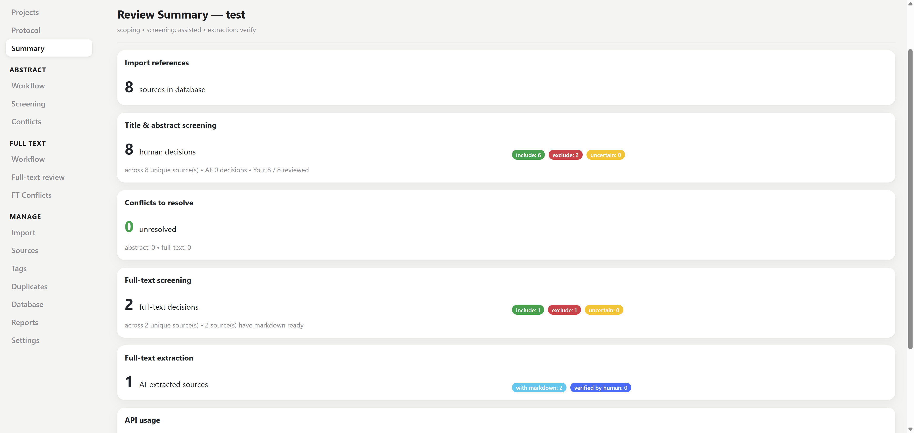
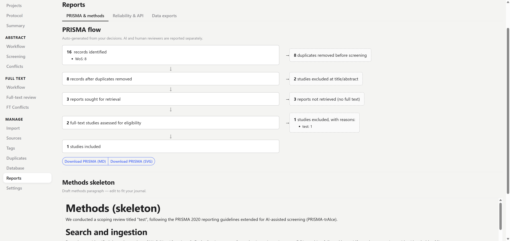
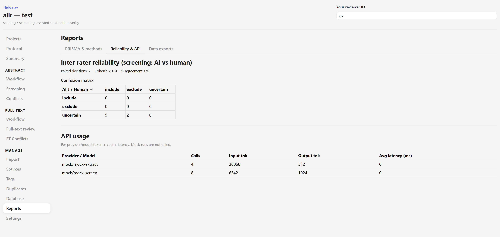
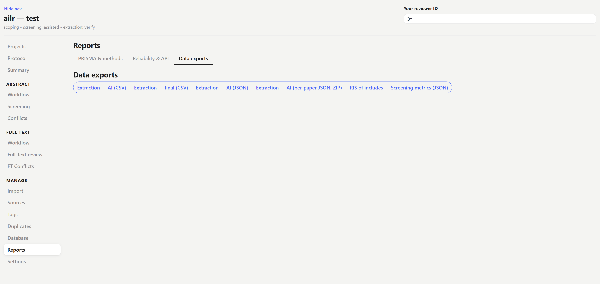
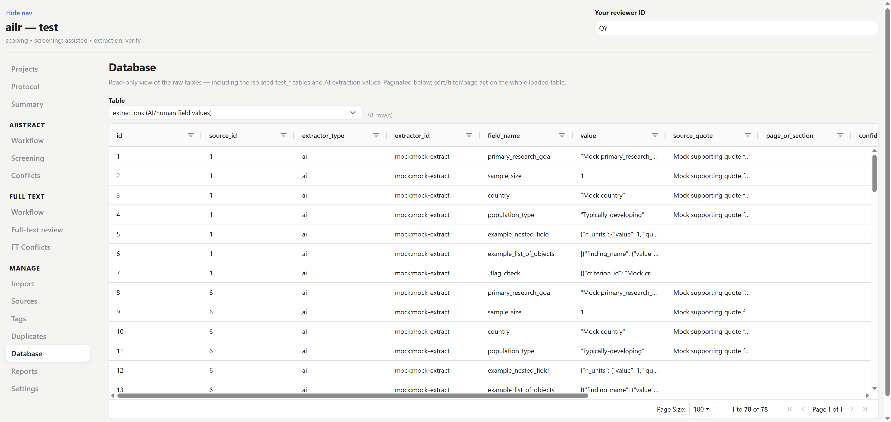

# Reports & exports

The final stage: the auditable outputs of the review. Because every decision and extraction was stored with its reviewer, timestamp, and prompt version, these reports are **derived from the data**, not assembled by hand, so they stay correct as you keep working. Sidebar: **Reports** (plus **Summary** for an at-a-glance dashboard, and **Database** to browse the raw tables).

## Summary

The **Summary** page is the dashboard you land on. It shows counts at each stage (imported, screened, included, extracted), so you can see at a glance how far the review has progressed and where the queue is backed up.



## Reports

The **Reports** page (split into **PRISMA & methods**, **Reliability & API**, and **Data exports** sub-tabs) assembles everything a methods section and a reproducibility appendix need:

| Report | What it gives you |
|--------|-------------------|
| **PRISMA flow** | records identified → deduplicated → screened → excluded (with reasons) → included; the identification box breaks down **records per source**, records found by [citation searching or hand searching](import.md#records-found-outside-a-database-search) get their own arm, and the diagram **exports as SVG** (vector) for your manuscript |
| **Methods skeleton** | a prose outline of how the review was run (workflow, models, criteria), including the **search strategies** you recorded at import |
| **Inter-rater reliability** | Cohen's κ, PABAK, percent agreement, and a **confusion matrix** for any pair of reviewers at either stage |
| **Quote audit** | every AI-extracted quote checked word for word against the paper it came from (see [below](#quote-audit)) |
| **API usage** | token counts and calls per stage; tokens only, so multiply by your provider's current rates |

Every number here traces back to stored rows: the PRISMA counts come from the actual decisions and recorded exclusion reasons, and the agreement figures from the reviewers' own verdicts, so the figures you report are the figures the app can defend. The methods skeleton follows the same rule for the AI: it reports the models and decoding settings the decisions were **actually made with**, read off the stored decisions, not the ones currently in `lit_review.yaml`. Change a model halfway through and the methods text says so, and a seed is only named when the provider actually accepts one. PRISMA counts are **per paper**, not per vote: in `independent` mode two reviewers including the same paper count it once, and a reconciliation overrides the individual votes.

A paper counts at a stage only once that stage is **settled** for it: everyone the [workflow](../protocol.md#workflow) calls for has voted, and any disagreement has been adjudicated. This holds for the excluded boxes as much as the included ones. A paper still waiting on a second reviewer or an adjudication counts as neither, and the flow lists it as **awaiting a decision**, so the boxes add up while the review is in progress; the line disappears once everything is settled.

These boxes depend on something you record rather than something the app infers:

- **Duplicates removed** counts the records dropped at import plus any you flag later with the **Duplicate** button. A flagged paper was, in PRISMA terms, removed before screening, so it appears in no box below this one. In a two-arm review each duplicate counts under the arm it was imported through, so each arm's **records identified** is its count before deduplication.
- **Reports not retrieved** counts only papers you marked as unobtainable on the [full-text review](full-text.md#2-full-text-review) page. A paper with no markdown yet is work outstanding, not a retrieval failure, so it does not land here.
- **Studies included** counts studies, and **reports of included studies** counts papers. They differ only if you grouped companion reports with **Same study as…**; otherwise the flow shows the single number, as most reviews should.
- **Of which extracted** counts included papers whose extraction has its final record: the checker's submission in `verify` extraction, the saved consensus in `independent` extraction. An AI pass alone does not count. The methods text reports the same number.

### Reading the reliability numbers

Pick the **stage** (abstract or full text) and the **pair of reviewers** — AI vs. a human in `assisted` mode, the two humans in `independent` mode, or any other combination if more than two people worked on the review. Only the records both of them judged are counted.

Conventions to know, because they are the ones journals ask about:

- **Votes are read as first cast, before adjudication.** Resolving a conflict does not improve the agreement figure, which is the point: κ describes how well the reviewers agreed independently. This is deliberately different from the PRISMA flow, where a reconciliation does override the votes.
- **Records flagged as duplicates are left out**, since the PRISMA flow counts them as removed rather than screened.
- **`uncertain` counts as an include** by default, because an uncertain vote does not exclude a record (a paper with one waits for adjudication rather than moving on). The three-way κ, which scores uncertain as its own class, is shown beside it, and switching **Categories** to three-way shows the full three-way table. Calibration reads κ the same way, so the κ you tune a prompt against is the one the methods text reports.

**PABAK** is shown next to κ because κ is depressed when one category dominates, which is the normal state of screening: at a 5% include rate, reviewers who agree on 95% of records can still show a κ near zero. PABAK adjusts for that. Report both, or report κ and explain the prevalence.

If you want to compute agreement some other way, **Download the votes behind this (CSV)** gives one row per record and one column per reviewer, covering the same records as the figures.

### Quote audit

Every AI-extracted value is supposed to come with a verbatim quote from the paper. **Run quote audit** (on the same sub-tab) checks that claim across the whole project, matching each stored quote word for word against the paper's markdown. It reports two numbers:

- **Coverage**: how many extracted values carry a quote at all. A field sitting near zero is usually a field the model does not know where to read from, which is a description problem, not a prompt problem.
- **Verbatim rate**: of the quotes that exist, how many are actually in the text. The per-field breakdown sorts the worst coverage to the top, and the quotes that were not found can be downloaded as CSV.

:::{important}
A "not found" quote is a **list to spot-check, not a hallucination verdict**. PDF-to-markdown conversion drops ligatures, hyphenation, and column breaks, so a perfectly honest quote can fail an exact match. Read a few before concluding anything; what matters is the pattern, not the individual miss.
:::

The same audit runs at two smaller scales, which is where it is most useful: on the summary of each [AI extraction run](extraction.md#3-run-ai-extraction), and on [quick-test calibration](extraction.md#calibrate-extraction) results, where a bad field shows up while it still costs a handful of papers.





## Exports

Export the dataset in the format your analysis needs:

| Format | Use |
|--------|-----|
| **CSV** | the extraction table for stats software (wide, with a `<field>_quote` column for every field, list fields included) |
| **JSON** | structured records (values + evidence quotes), combined for all papers |
| **Per-paper JSON (ZIP)** | one `<source_id>.json` per paper, zipped; handy for spot-checking or per-paper archiving |
| **RIS** | the papers in the full-text queue (abstract screening settled on include, duplicates left out) back into a reference manager |
| **PRISMA SVG** | the flow diagram as a vector image, ready for a manuscript figure |

CLI equivalent:

```bash
ailr export <project-folder> --format csv          # also: json · ris · prisma-svg
```



Bibliographic metadata is joined into every export by `source_id`, so each row carries both the trusted citation and the AI-extracted full-text data: one table, ready to analyse, with the source quote available for any value you need to defend.

Each row also carries an **`extractor_id`**. The final export uses a paper's reconciled **consensus** record when it has one. Until then, in `independent` extraction each reviewer's submitted extraction is exported as its own row (two files in the ZIP) rather than merged into one, and a draft nobody has submitted is left out.

## Out of scope

Meta-analysis and GRADE certainty ratings are not part of ailr. Export the extraction table and run those in R (`metafor`), RevMan, or GRADEpro.

## Browse the raw data

The **Database** page lets you browse the underlying tables directly. It is useful for spot-checking a decision or extraction, or for understanding how a number on a report was derived. It loads the whole table and **paginates** (25 / 50 / 100 / 200 per page), so sort and filter span every row, not just the first screenful. It is read-oriented: a window onto the same append-only tables the reports are built from. See [Internals](../internals.md) for the table layout.


